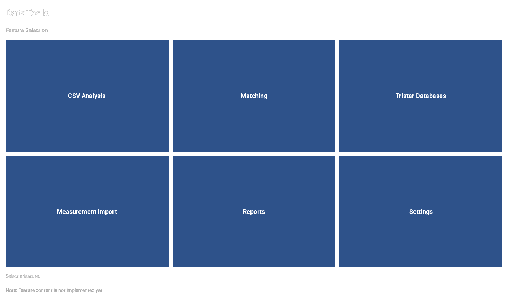
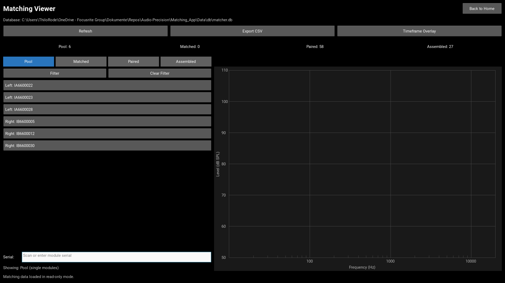
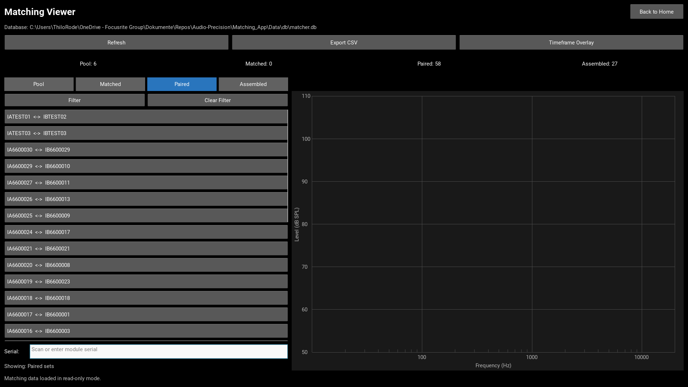
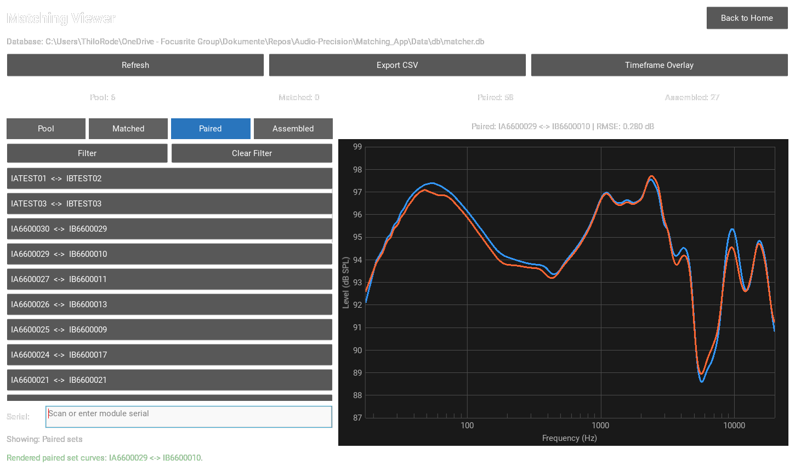
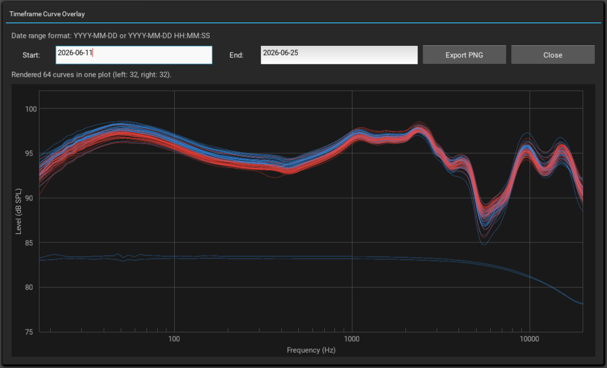
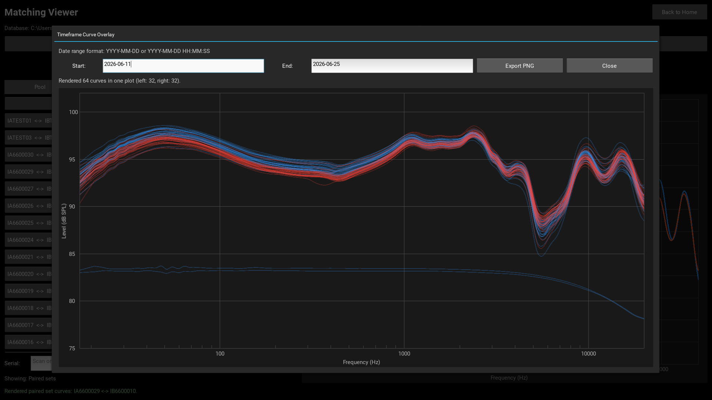

# DataTools Matching Viewer User Manual

This manual documents the DataTools Matching Viewer in read-only mode.
It includes detailed workflows, keyboard-first operation, and troubleshooting.

## Purpose

The Matching Viewer is used to inspect existing matcher data without changing it.
Main capabilities:

- View pool, matched, paired, and assembled states
- Inspect one serial quickly via Enter-based lookup
- Plot single curves or left/right pair overlays
- Filter any list by date range to reduce scrolling
- Open timeframe overlay to display many curves together
- Export a read-only CSV snapshot of all data

## Navigation

1. Open DataTools.
2. Click the Matching tile.
3. The viewer opens in the same window.
4. Use Back to Home to return.

## Home Screen

## Matching Viewer Overview

Areas in this screen:

- Top toolbar: Refresh, Export CSV, Timeframe Overlay
- Summary row: Pool, Matched, Paired, and Assembled counts
- Left panel: mode selection, date filter buttons, and serial input
- Right panel: selected item label with RMSE, and chart
- Footer line: status and error feedback
- Error messages are highlighted in red for fast operator recognition

## Mode Selection

Modes:

- **Pool**: Single unmatched drivers awaiting matching.
- **Matched**: Left/right pairs suggested by the matching tool, but not yet confirmed for installation. A worker has seen the suggested match serial on screen but has not yet scanned it.
- **Paired**: Confirmed pairs sorted for installation. The worker scanned both module serials, marking them as a set to be installed together.
- **Assembled**: Completed systems. Each entry links a system serial number to the two installed driver modules and the date of assembly.

## Filtering by Date Range

All list views support date-range filtering to reduce scrolling in long lists. Each mode filters by a different date field:

| Mode      | Date field   | Meaning                                    |
|-----------|--------------|--------------------------------------------|
| Pool      | `loaded_at`  | Measurement date of the driver             |
| Matched   | `loaded_at`  | Measurement date of the driver             |
| Paired    | `matched_at` | Date when the worker confirmed the pair    |
| Assembled | `built_at`   | Date when the system was assembled         |

### How to Filter

1. Switch to the desired mode (Pool, Matched, Paired, or Assembled).
2. Click the **Filter** button in the left panel.
3. Enter a **Start** date (e.g., `2026-06-22`).
4. Enter an **End** date (e.g., `2026-06-29`).
5. Click **Apply** or press Enter in either date field.
6. Only items within the date range are shown in the list.
7. Click **Clear Filter** to show all items again.

### Supported Date Formats

- `YYYY-MM-DD`
- `YYYY-MM-DD HH:MM`
- `YYYY-MM-DD HH:MM:SS`
- `YYYY-MM-DDTHH:MM`
- `YYYY-MM-DDTHH:MM:SS`

### Filter Behavior

- **Auto-save**: The last used date range is saved per mode. Switching between modes preserves each mode's own filter settings independently.
- **Default range**: If no filter has been set before, the default is the last 30 days.
- **Error feedback**: Invalid dates or an end date before start date are highlighted in red.
- **Count display**: After filtering, you see how many items match the range, e.g., `Filtered: 12 of 58 items in range.`

## Serial Lookup (Enter Only)

Workflow:

1. Scan or type module serial in the Serial field.
2. Press Enter.
3. Viewer auto-switches to the relevant mode and displays curve(s).
4. Input field is cleared after a successful lookup.

### Important: Lookup Ignores Active Filters

**Serial lookup searches the entire database, not just the filtered list.** This means:

- If you search for a serial that is **outside the active timeframe filter**, it will still be found and displayed.
- The filter only affects what is shown in the list view; it does not restrict the search capability.
- This allows you to quickly access any module even if it falls outside your current date range.

## Timeframe Overlay

The overlay popup draws all curves in one selected period in one shared chart.
Color coding:

- Blue: left modules
- Red: right modules
- Both are thin and semi-transparent for dense overlays

### Default Overlay on Open

Behavior:

- Last used timeframe is restored automatically
- If no value exists yet, default is last 7 days
- Overlay is rendered automatically when popup opens

### Date Input Formats

Accepted formats:

- YYYY-MM-DD
- YYYY-MM-DD HH:MM
- YYYY-MM-DD HH:MM:SS
- YYYY-MM-DDTHH:MM
- YYYY-MM-DDTHH:MM:SS

Press Enter in either date field to refresh the overlay.

### Validation Error: Invalid Date Format

If date format is invalid, an error is shown in red and plot is not updated.

### Validation Error: End Before Start

If End is before Start, an error is shown in red and no new query is executed.

### Custom Valid Range Result

When range is valid, all matching curves are rendered and count summary is shown.

### Export Overlay Plot as PNG

After rendering an overlay, you can export the current plot to a PNG file without opening a separate window:

1. Render a valid overlay by entering dates and clicking Apply (or pressing Enter).
2. Click the **Export PNG** button in the popup controls.
3. A native save dialog opens.
4. Choose a destination and confirm.
5. The plot is saved as PNG in light mode with a legend showing left/right curve labels.

**Features:**

- Matplotlib renders in the background (no additional window appears).
- PNG uses light-mode styling (white background, black text) for better printing and sharing.
- Title shows the timeframe of the exported overlay (Start to End dates).
- Individual curves shown as thin semi-transparent lines.
- Median curves calculated and shown as thick dotted lines for each side (blue for left, red for right) to ignore outliers.
- Legend shows: individual modules, left median, right median.
- Log-scale frequency axis and all curve colors and transparency are preserved.
- Default filename is `overlay_plot.png`, can be changed in save dialog.

## Read-Only Guarantee

The Matching Viewer does not change matcher database content.
Operations are read-only, except CSV and PNG exports which write separate output files.

## CSV Export

1. Click Export CSV.
2. Choose destination in native save dialog.
3. The file contains two sections:

**Section 1 - Drivers** (`serial`, `side`, `status`, `partner`, `loaded_at`, `matched_at`)

**Section 2 - Assembled** (`system_serial`, `module_1`, `module_2`, `built_at`)

The export summary shows how many driver rows and assembled system rows were written, e.g., `Exported 64 drivers + 27 assembled systems`.

## Troubleshooting

### Overlay shows no curves

- Check selected timeframe includes known loaded_at data.
- Verify matching DB path in Settings is correct.
- Confirm matcher DB contains level arrays.

### Serial lookup returns not found

- Verify scanned serial matches database value.
- Ensure scanner input has no trailing hidden characters.
- Confirm current DB file is the expected production/test DB.

### Viewer opens but data is empty

- Use Settings to validate matching DB path.
- Check DB file exists and is not locked by another process.
- Press Refresh in viewer toolbar.

### Assembled list is empty

- Confirm the matcher DB contains a `system_builds` table.
- Press Refresh to reload data from the current DB file.

## Generator Info

This manual is auto-generated by docs/scripts/generate_matching_viewer_markdown.py.
