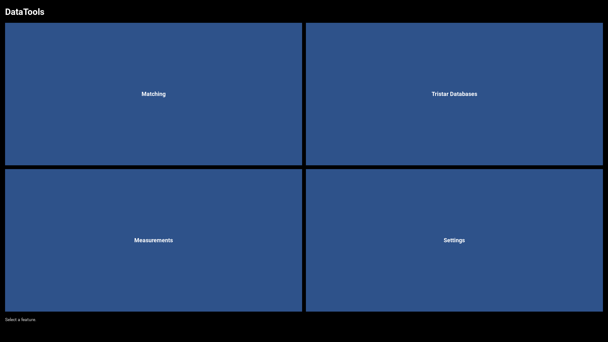
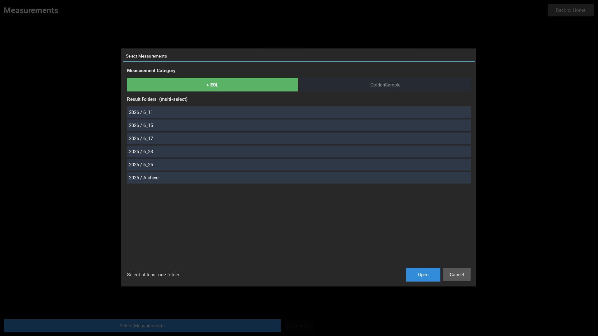
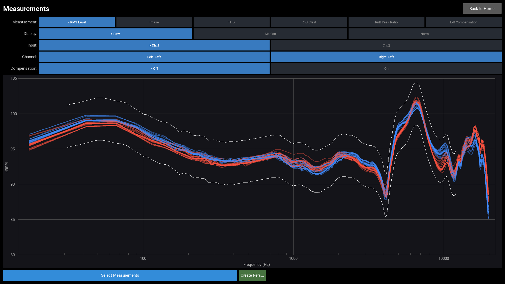
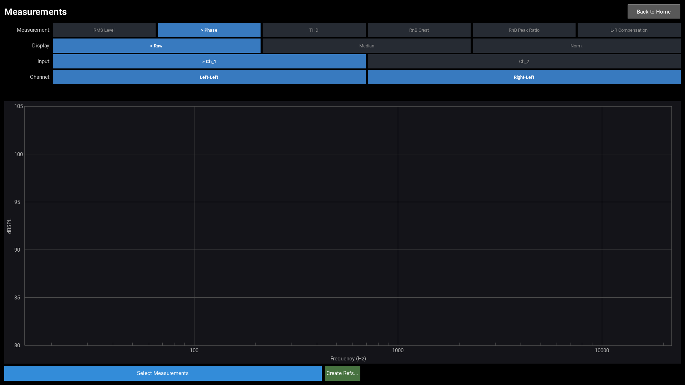
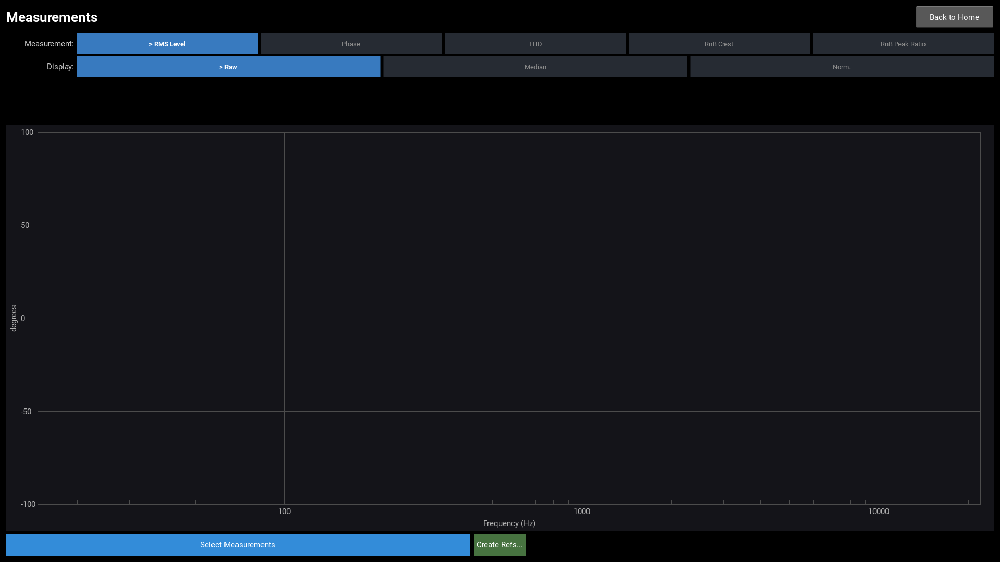
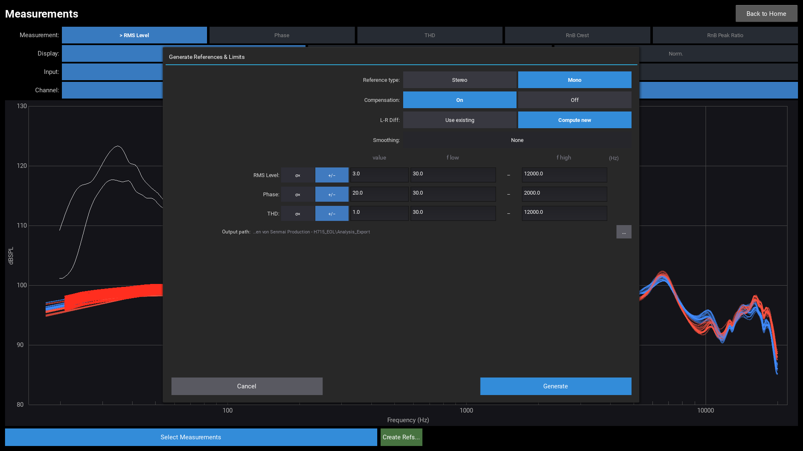

# DataTools Measurements Viewer

This manual covers the full workflow for loading APx measurement CSV files,
visualising frequency-response charts, and generating reference curves and limit files.

## Overview

The Measurements viewer provides three main functions:

1. **Select Measurements** — choose a product category and one or more result folders.
2. **Chart** — visualise individual runs, medians, limits and sub-channel curves.
3. **Create Refs...** — compute median reference curves and statistical limits; export CSVs, PNG plots and a README.

## Home Screen



Click the **Measurements** tile to open the viewer.

## Selecting Measurements



The **Select Measurements** popup opens automatically when the viewer starts.
It can also be reopened at any time via the **Select Measurements** button.

### Step 1 — Choose a Category

Toggle buttons at the top select the measurement category:

| Category | Description |
| --- | --- |
| EOL | End-of-line production measurements |
| GoldenSample | Reference golden-sample measurements |
| Reference | Reference measurements for limit generation |

### Step 2 — Select Result Folders

The scrollable list shows all available result folders under `Measurements/<Category>/`.
Multiple folders can be selected at once — all selected runs are loaded together.

Click **Open** to load the selection into the chart.

## Chart — Stereo Example (H715)



### Measurement Type

Buttons in the **Measurement** row switch the plotted data type:

| Type | Y-axis | Description |
| --- | --- | --- |
| RMS Level | dBSPL | Frequency-response amplitude |
| Phase | degrees | Frequency-response phase |
| THD | % | Total Harmonic Distortion |
| RnB Crest | dB | Rub-and-Buzz crest factor |
| RnB Peak Ratio | dB | Rub-and-Buzz peak ratio |
| L-R Compensation | dB | Left-Right difference curve (only when loaded) |

### Display Mode

| Mode | Description |
| --- | --- |
| Raw | All individual measurement curves (semi-transparent) |
| Median | Per-channel median curve only |
| Norm. | Each curve shown as deviation from its channel median |

### Input Channel

For multi-input measurements, the **Input** row filters to one input channel at a time.

### Sub-Channel (Channel row)

When a measurement type has multiple sub-columns (e.g. Left / Right for stereo),
individual sub-channels can be toggled on and off independently.

### L-R Compensation (stereo RMS Level only)

When a `L-R-Diff.csv` fixture compensation curve is present,
the **Compensation** row appears for RMS Level in stereo mode:

| Setting | Effect |
| --- | --- |
| Off | Raw levels displayed |
| On | L-R difference applied (±½ diff per channel) to equalise fixture offsets |

## Chart — Phase View



Switching to the **Phase** type shows the frequency-response phase curves.
Reference limit bands (if available) are overlaid automatically.

## Chart — Mono Example (Sub8PRO)



Measurements with a single data column show one curve set.
The Channel sub-column row and the Compensation toggle are not shown.
A single-input product can still have Left/Right sub-columns — in that case
the Channel row and Compensation toggle appear just as they do for multi-input data.

## Analysis Dialog



Open via the **Create Refs...** button (available after data is loaded).

### Reference Type (stereo only)

| Option | Description |
| --- | --- |
| Stereo | Separate Left and Right reference curves |
| Mono | Average Left and Right into a single reference curve |

### Compensation (stereo only)

| Option | Description |
| --- | --- |
| On | Apply L-R fixture compensation before computing the reference |
| Off | Compute reference without compensation |

### L-R Diff (stereo only)

| Option | Description |
| --- | --- |
| Use existing | Load `L-R-Diff.csv` from the References folder |
| Compute new | Recompute from current measurements and export Right−Left |

### Smoothing

1/N octave log-scale smoothing applied to reference and limit curves before export.
`None` disables smoothing.

### Per-Type Limit Settings

Each measurement type (RMS Level, Phase, THD) has independent limit settings:

| Control | Description |
| --- | --- |
| σ× | Limit width = value × standard deviation (frequency-dependent) |
| +/− | Fixed absolute offset — stored as a constant 2-point boundary line |
| Value | Multiplier (σ× mode) or offset magnitude (+/− mode) |
| f low | Lower frequency bound for limit computation [Hz] |
| f high | Upper frequency bound for limit computation [Hz] |

### Output Path

The output folder is set via the **…** Browse button.
All files are written into this folder:

| File / Folder | Content |
| --- | --- |
| `RMS.csv` | Median RMS reference curve(s) |
| `Phase.csv` | Median phase reference curve(s) |
| `THD.csv` | Median THD reference curve(s) |
| `L-R-Diff.csv` | Right−Left compensation curve (if Compute new selected) |
| `Limits/` | Six limit CSVs (upper/lower per type) |
| `Plots/` | PNG plots: individual curves + median + limit bands |
| `README.md` | Deployment instructions and file overview |

Click **Generate** to run the analysis and save all files.

## Deploying the Analysis Output

The workstation reads references from a `References/` folder inside the
measurements root directory (configured in **Settings → Measurements Root Folder**).

Copy the generated files as follows:

```
<Measurements root>/
├── References/
│   ├── EOL/                 ← or GoldenSample — mirrors the Measurements structure
│   │   ├── RMS.csv
│   │   ├── Phase.csv
│   │   ├── THD.csv
│   │   └── Limits/          ← copy the limit files here
│   │       ├── RMS.csv
│   │       ├── PhaseUpper.csv
│   │       ├── PhaseLower.csv
│   │       └── THD.csv
│   ├── GoldenSample/        ← same structure if GoldenSample refs exist
│   │   └── ...
│   └── L-R-Diff.csv         ← stereo only: shared Left/Right compensation curve
└── ...
```

> **Note:** The `Plots/` subfolder contains PNG overview charts for visual
> inspection. These plots are **not** used by the workstation.

### Exported File Reference

| File | Description | Unit |
| --- | --- | --- |
| `RMS.csv` | Median RMS level reference curve(s) | dBSPL |
| `Phase.csv` | Median phase reference curve(s) | deg |
| `THD.csv` | Median THD reference curve(s) | % |
| `L-R-Diff.csv` | Median Right−Left difference curve (stereo only) | dB |
| `Limits/RMS.csv` | RMS tolerance — half-width of the pass band | dB |
| `Limits/PhaseUpper.csv` | Phase upper tolerance | deg |
| `Limits/PhaseLower.csv` | Phase lower tolerance (negated) | deg |
| `Limits/THD.csv` | THD tolerance as a relative factor | % |

All CSV files use the **AP 4-header format**: 4 rows of header followed by X/Y data pairs.

### Limit Modes

Each measurement type can use one of two limit modes:

| Mode | Stored as | Description |
| --- | --- | --- |
| **σ×** | Full-resolution curve | Limit = value × standard deviation at each frequency point |
| **+/−** | 2-point boundary line | Fixed absolute offset — constant across the frequency range |

The chosen mode and value are recorded in the `README.md` inside the export folder.

## Measurements Root Folder

The root folder must follow this structure:

```
Root/
  Measurements/
    EOL/                 ← or GoldenSample
      2026/
        6_25/            ← result folder (one run = one set of CSV files)
    GoldenSample/        ← same structure
      2026/
        ...
  References/            ← mirrors the Measurements category structure
    EOL/
      RMS.csv            ← median reference (generated by Create Refs...)
      Phase.csv
      THD.csv
      Limits/
    GoldenSample/        ← same structure
      ...
    L-R-Diff.csv         ← stereo only: shared compensation curve
```

Configure the root folder in **Settings → Measurements Root Folder**.
