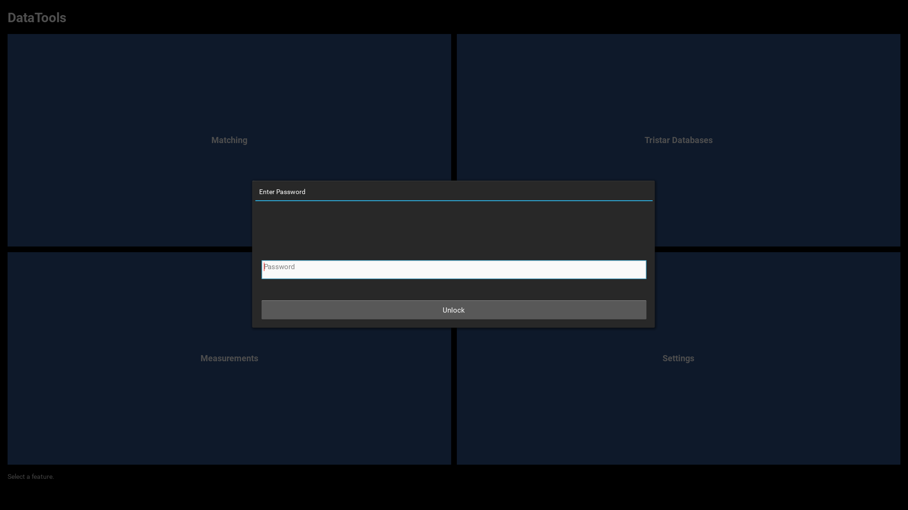
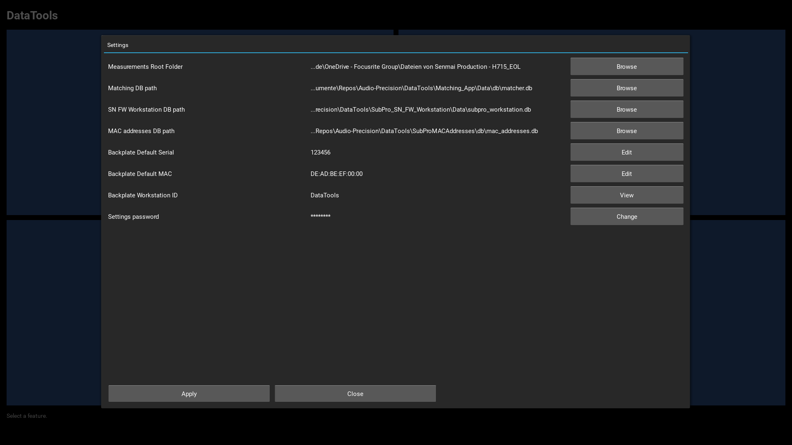
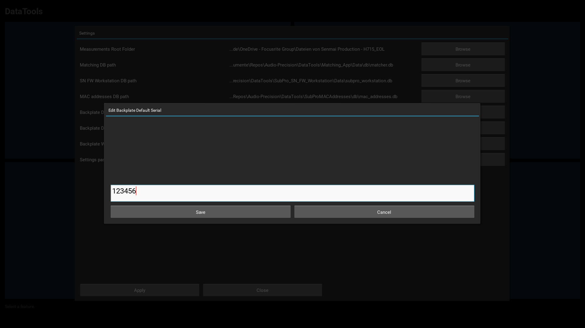
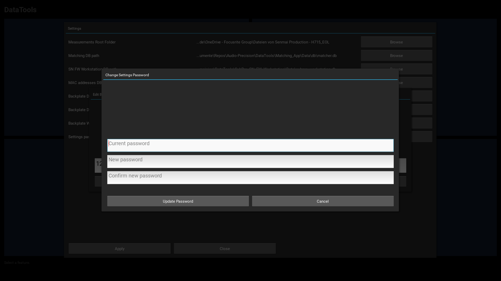

# DataTools Settings Menu

This guide provides comprehensive documentation for the DataTools Settings menu.
It covers configuration tasks, user workflows, troubleshooting, and UI features.

## Purpose and Scope

This manual documents all configuration options accessible through the Settings menu:

- Password-protected access control
- CSV delimiter and decimal separator configuration
- Export folder and database path management
- Settings password change and security

## Prerequisites

Before using the Settings menu, ensure the following:

- DataTools is running and the home screen is visible.
- You know the current settings password.
- All required target folders and database files exist on your system.

## Quick Start

1. Select the Settings tile on the home screen.
2. Enter the correct password and click Unlock.
3. Modify settings using the Edit or Browse buttons.
4. Click Apply to save your changes.
5. Click Close to exit the Settings menu.

## Home Screen

The home screen displays feature tiles for different DataTools functions.
Click the Settings tile to access the configuration area.

## Accessing the Settings Menu

The Settings menu requires authentication for security.
Enter your password and click Unlock to proceed.

## Field Reference

| Field | Purpose | Edit Method |
| --- | --- | --- |
| Measurements Root Folder | Root folder with Measurements/, References/ and DefaultReferences/ subfolders | Browse |
| Matching DB path | Path to Matching database | Browse |
| SN FW Workstation DB path | Path to SN/FW Workstation database | Browse |
| MAC addresses DB path | Path to MAC addresses database | Browse |
| Backplate Default Serial | Device serial number placeholder before MAC provisioning | Edit |
| Backplate Default MAC | Device MAC address placeholder before provisioning | Edit |
| Backplate Workstation ID | Identifier for audit trail in provisioning logs | View |
| Settings password | Password for Settings menu access | Change |

## The Settings Panel

The Settings panel displays all configuration parameters.
Each field shows its current value and an action button:
- **Browse**: Select file or folder paths using native file dialogs
- **Change**: Modify the Settings password securely
- **View**: Display read-only field values
- **Edit**: Modify text values via a large-text input dialog

## Detailed Workflows

### Configuring Paths

To set database or folder paths:

1. Click Browse next to the path field.
2. A native file or folder selection dialog opens.
3. Navigate to and select the desired file or folder.
4. The new path is immediately displayed and stored.

### Editing Text Values

Some fields (e.g. Backplate Default Serial, Backplate Default MAC) are edited via a text input dialog:

1. Click **Edit** next to the field.
2. Enter the new value in the text box.
3. Click **Save** to apply or **Cancel** to discard.

### Changing the Settings Password

To update your Settings password:

1. In the Settings password row, click Change.
2. Enter your current password in the first field.
3. Enter your new password in the second field.
4. Re-enter the new password in the confirmation field.
5. Click Update Password to save the change.

## User Interface Features

- **Path Truncation**: Long file paths are displayed on one line, truncated intelligently
  to keep the filename and relevant directory components visible.
- **Auto Focus**: When a dialog opens with multiple input fields, focus automatically
  moves to the first field for faster data entry.
- **Password Security**: Passwords are never displayed in clear text—always masked with asterisks.
- **Error Highlighting**: Validation errors are shown in red to make failures immediately visible.
- **Immediate Persistence**: All changes are immediately written to the database.

## Troubleshooting

### Password is rejected

- The error text is highlighted in red for clear feedback.
- Verify that CAPS LOCK is not enabled (passwords are case-sensitive).
- Ensure you are entering the correct password.
- Contact your system administrator if you cannot remember your password.

### Cannot select a path

- Verify that the drive or network location is accessible and connected.
- Check that you have read permissions for the selected folder or file.
- For network paths, ensure the resource is online and reachable.

### Changes are not saved

- Click Apply in the Settings panel to ensure changes are persisted.

## Backplate Provisioning Settings

The Backplate Provisioning feature allows automatic MAC address assignment to spare units.
Three settings control this workflow:

### Backplate Default Serial

- **Purpose**: Reference serial number of a spare backplate unit before MAC provisioning
- **Default**: `123456`
- **Edit Method**: Click Edit to change the value
- **Used By**: Backplate Provisioning popup for device state comparison

### Backplate Default MAC

- **Purpose**: Reference MAC address of a spare backplate unit before provisioning
- **Default**: `DE:AD:BE:EF:00:00` (placeholder/reserved range)
- **Edit Method**: Click Edit to change the value
- **Format**: Standard MAC address notation: `XX:XX:XX:XX:XX:XX` (colon-separated hexadecimal)
- **Used By**: Backplate Provisioning popup for device state validation

### Backplate Workstation ID

- **Purpose**: Identifier used in provisioning audit logs to track which workstation performed provisioning
- **Default**: `DataTools`
- **Edit Method**: View only (read-only field)
- **Used By**: MAC provisioning database for audit trail

### Configuration Workflow

To adjust Backplate Provisioning defaults:

1. In the Settings panel, scroll to find the three Backplate settings
2. For **Backplate Default Serial**: Click Edit and enter the device serial number
3. For **Backplate Default MAC**: Click Edit and enter the MAC address (format: `XX:XX:XX:XX:XX:XX`)
4. **Backplate Workstation ID** cannot be edited (read-only)
5. Click Apply in the Settings panel to save changes
