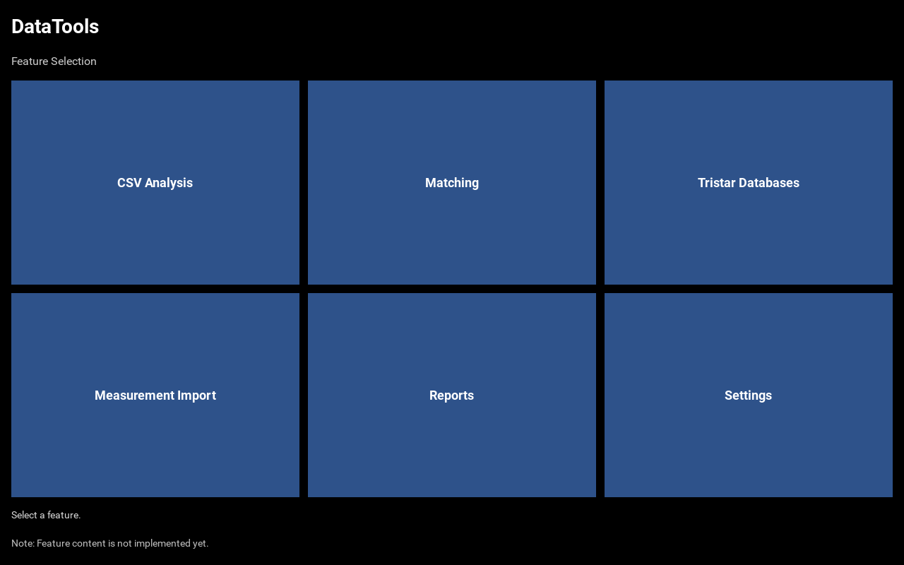
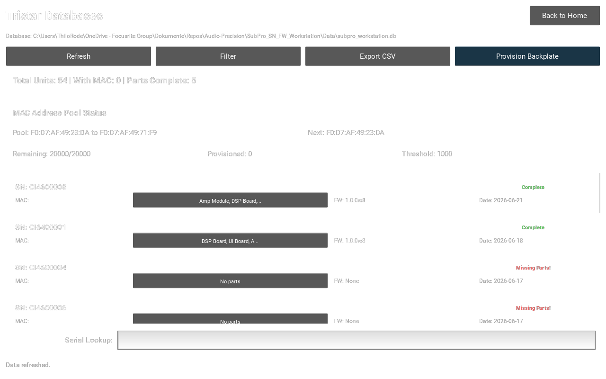
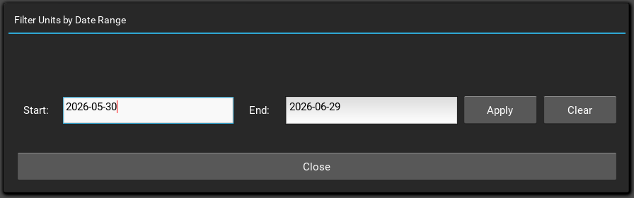
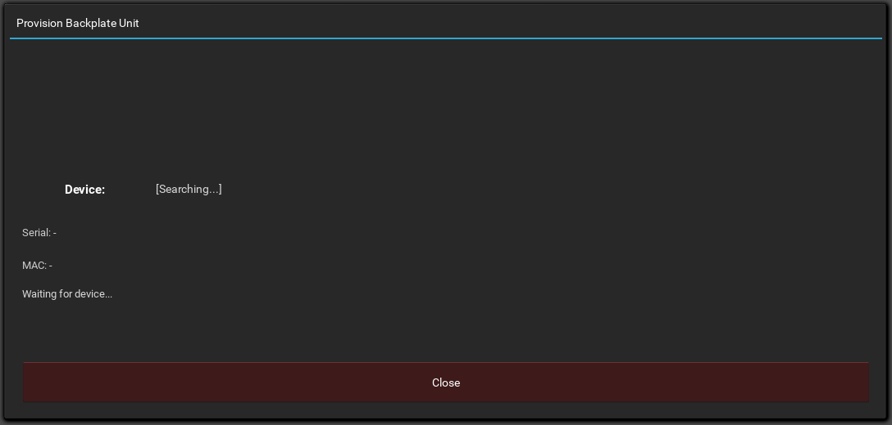

# Tristar Databases Viewer Manual

## Overview

The Tristar Databases Viewer is a unified read-only interface for monitoring Serial Number/Firmware (SN/FW) testing data and MAC address provisioning status. It also provides automated MAC address provisioning for spare backplate units.

### Key Features

- **Unified View**: Combine data from two databases (SN/FW and MAC addresses)
- **Real-time Monitoring**: View test results, part configurations, and MAC status
- **Date Range Filtering**: Filter units by test completion timeframe
- **Serial Lookup**: Quick search for specific device serial numbers
- **CSV Export**: Export complete unit and parts data with MAC information
- **Backplate Provisioning**: Automatic MAC address assignment for new backplate units

## Prerequisites

Before using the Tristar Viewer, ensure:

- Both SN/FW and MAC databases are accessible via Settings
- For Backplate Provisioning: OCA devices are reachable on the network
- For Backplate Provisioning: MAC pool is configured with available addresses

## Quick Start

1. **From Home**: Click the Tristar Databases tile
2. **View Data**: Browse all units with their test results and MAC status
3. **Filter**: Click Filter to narrow results by date range (optional)
4. **Search**: Use Serial Lookup to find a specific device
5. **Export**: Click Export CSV to save data to file
6. **Provision**: Click Provision Backplate for automated MAC assignment

## Home Screen



The home screen displays the Tristar Databases tile along with other DataTools features.

## Tristar Viewer Main Window



### Header Section

- **Title Bar**: Shows 'Tristar Databases' with Back to Home button
- **Database Path**: Displays the SN/FW database location

### Toolbar Buttons

| Button | Function |
| --- | --- |
| Refresh | Reload data from databases |
| Filter | Open date range filter popup |
| Export CSV | Save unit and parts data to CSV file |
| Provision Backplate | Auto-assign MAC to spare backplate units |

### Summary Panel

Displays aggregate statistics:
- **Total Units**: Count of unique serial numbers
- **With MAC**: Units that have been MAC provisioned
- **Parts Complete**: Units with all expected parts scanned

### MAC Pool Status

Shows provisioning pool statistics:
- **Range**: MAC address start and end
- **Next MAC**: Next available address to assign
- **Remaining**: Count of unassigned MACs
- **Provisioned**: Count of already-assigned MACs

### Units List

Two-row layout per unit:
- **Row 1**: Serial number and current MAC (or '-' if not yet provisioned)
- **Row 2**: Test result, timestamp, parts status (green = complete, red = incomplete)

Click a unit row to view its scanned parts and serial numbers.

## Date Range Filter



### Supported Date Formats

| Format | Example |
| --- | --- |
| Date only | YYYY-MM-DD (2026-06-29) |
| Date + Time (ISO) | YYYY-MMTHH:MM (2026-06-29T14:30) |
| Date + Time (Space) | YYYY-MM-DD HH:MM (2026-06-29 14:30) |
| Full timestamp | YYYY-MM-DD HH:MM:SS (2026-06-29 14:30:45) |

### Workflow

1. Click **Filter** button in toolbar
2. Enter **Start Date** (default: 30 days ago)
3. Enter **End Date** (default: today)
4. Click **Apply** to filter units
5. Results update to show only units in date range

## Backplate Provisioning



### Overview

The Backplate Provisioning feature enables automatic MAC address assignment for spare units without manual intervention. Suitable for production assembly lines.

### Automatic Workflow

1. **Connect Device**: Connect OCA-enabled device to network
2. **Auto-Discovery**: Popup searches for device (every 2 seconds)
3. **Auto-Read**: Serial number and current MAC read from device
4. **Auto-Validate**:
   - If Serial = Default Serial (123456) → ERROR: Device not registered
   - If MAC = Default MAC (DE:AD:BE:EF:00:00) → Ready to provision
   - If MAC ≠ Default & in DB → Already provisioned (no action)
   - If MAC ≠ Default & unknown → Error (manual investigation)
5. **Auto-Unlock**: Device factory settings unlocked (if ready)
6. **Auto-Provision**: MAC address assigned from pool and written to device
7. **Verify**: MAC read back and confirmed
8. **Database Update**: Provisioning logged to database
9. **Disconnect**: Device can be removed, ready for next unit

### Status Messages

| Status | Meaning | Action |
| --- | --- | --- |
| [Searching...] | Looking for OCA device | Wait, check network |
| [Connected] Device | Device found, reading... | None (automatic) |
| [OK] Provisioned | MAC successfully assigned | Disconnect device |
| [ERROR] ... | Problem occurred | Check message, retry |

### Status Panel Fields

- **Device**: Current connection status and device name
- **Serial**: Current device serial number
- **MAC**: Current device MAC address (before/after provisioning)
- **Status**: Detailed message about provisioning state

### Workflow Example

**Successful provisioning:**

```
1. [Searching...]  → No device connected yet
2. [Connected] SubPro-123ABC  → Device found
   Serial: SP12345  MAC: DE:AD:BE:EF:00:00
3. Status: Ready to provision. Unlocking device...
4. Status: Device unlocked. Provisioning MAC...
5. [OK] Provisioned
   Serial: SP12345  MAC: 02:00:00:00:00:01
   Status: [OK] Provisioned. Disconnect to provision next.
6. (User disconnects device)
7. [Searching...]  → Ready for next device
```

**Device with invalid/default serial (NOT provisioned):**

```
1. [Searching...]  → No device connected yet
2. [Connected] SubPro-ABCDEF  → Device found
   Serial: 123456  MAC: DE:AD:BE:EF:00:00
3. [ERROR] Device has default serial '123456' - not registered. Cannot provision.
   (NO provisioning occurs - device not registered)
4. (User disconnects device)
5. [Searching...]  → Ready for next device
```

### Troubleshooting

| Error | Cause | Solution |
| --- | --- | --- |
| [ERROR] Device has default serial | Device not registered in database | Register device SN in database first |
| [ERROR] Unknown device | MAC on device but SN not in DB | Manual investigation required |
| [ERROR] MAC mismatch | DB MAC differs from device MAC | Check device and database |
| [ERROR] duplicate_sn | SN already in DB with different MAC | Remove duplicate SN entry |
| [ERROR] pool_exhausted | No MACs available in range | Expand MAC pool configuration |
| [Searching...] (long time) | Device not reachable | Check network, firewall, IP |

## Export to CSV

### Workflow

1. Click **Export CSV** button
2. Choose save location and filename
3. File is saved with all filtered units and their parts

### CSV Structure

```
Serial,Test_Result,Timestamp,MAC_Address,Parts_Complete
SP001,PASS,2026-06-29 14:30:00,02:00:00:00:00:01,YES
SP002,FAIL,2026-06-28 10:15:00,-,NO
```

### Parts Consolidation

All scanned parts for each unit are consolidated with:
- Part name (e.g., 'Driver_Left')
- Part serial number (e.g., 'DRV12345')

## Settings Integration

### Backplate Configuration

Backplate provisioning defaults are configured via Settings:

| Setting | Default | Purpose |
| --- | --- | --- |
| Backplate Default Serial | 123456 | Device serial before provisioning |
| Backplate Default MAC | DE:AD:BE:EF:00:00 | Device MAC before provisioning |
| Backplate Workstation ID | DataTools | Audit trail identifier |

### How to Configure

1. From Home, click **Settings**
2. Enter password to unlock
3. Scroll to 'Backplate Default Serial'
4. Click **Edit** to change values
5. Confirm changes (stored in DataTools database)

## Support & Resources

For issues, error messages, or feature requests, see:
- DataTools README
- Workstation SN/FW documentation
- MAC Provisioning documentation
