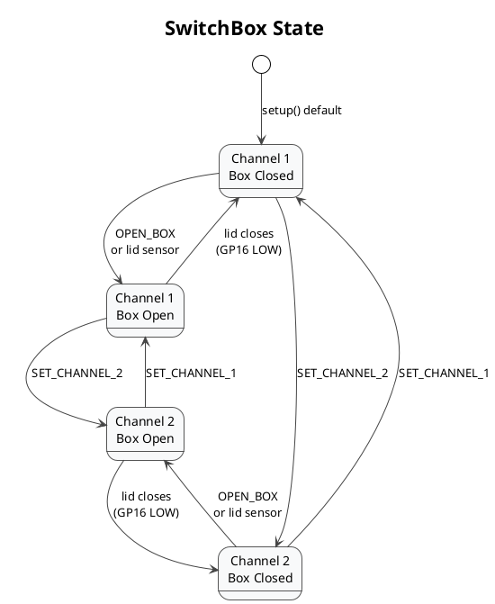

# Switch — Headphone Channel Selector Firmware

Firmware for the SwitchBox hardware controller used in ADAM Audio production workstations. Runs on a **Raspberry Pi Pico (RP2040)** and is the physical counterpart to [`hardware/switchbox.py`](../hardware/switchbox.py) in the production backend.

## Hardware

| Pin | Direction | Function |
|---|---|---|
| GP28 | Output | Relay — routes audio between channel 1 and channel 2 |
| GP16 | Input (Pull-up) | Micro-switch — detects whether the box lid is closed |
| GP17 | Output | Box opener — activates the lid-release mechanism |

USB identification is handled by the RP2040's built-in USB-Serial bridge. Python identifies the device by vendor ID and product ID via `serial.tools.list_ports`.

## Serial Protocol

The Python layer sends ASCII commands terminated with `\n` at **9600 baud** over the USB serial port. The Pico responds with a status line.

### Commands

| Command | Effect |
|---|---|
| `SET_CHANNEL_1` | Relay LOW → routes channel 1 |
| `SET_CHANNEL_2` | Relay HIGH → routes channel 2 |
| `OPEN_BOX` | Activates lid-release mechanism for 2 s (on Core 1) |
| `GET_STATUS` | Requests current status output |

### Status Response

The Pico always responds with a **2-bit binary string** printed to serial:

```
Bit 1 (0b10): channel  — 0 = channel 1, 1 = channel 2
Bit 0 (0b01): box      — 0 = closed,    1 = open
```

| Response | Channel | Box |
|---|---|---|
| `0` | 1 | Closed |
| `1` | 1 | Open |
| `10` | 2 | Closed |
| `11` | 2 | Open |

Status is also sent **automatically** whenever the box state changes. The `loop()` continuously polls GP16, so the Python layer can react to state changes without actively polling.

## Multicore Design

`OPEN_BOX` is delegated to **Core 1** via `multicore_fifo_push_blocking(1)`. This is necessary because `openBox()` calls `delay(2000)` which would block Core 0 for 2 seconds. With Core 1 handling the box opener, Core 0 remains responsive to serial commands and box-state monitoring throughout the operation.

```
Core 0 (loop)                    Core 1 (core1Task)
─────────────────────────        ───────────────────────────
Serial command processing        Waits on FIFO pop
Box-state monitoring             On signal=1: runs openBox()
Channel switching                  GP17 HIGH → delay(2s) → LOW
Status output
```

## Communication with Python

```
Python switchbox.py               Pico Switch.ino
─────────────────────             ──────────────────────────
serial_connect()         USB      Serial.begin(9600)
switch_to_channel(1)  ──────►  "SET_CHANNEL_1\n"
                         ◄──────  "0\n"   (Ch1, closed)
switch_to_channel(2)  ──────►  "SET_CHANNEL_2\n"
                         ◄──────  "10\n"  (Ch2, closed)
open_box()            ──────►  "OPEN_BOX\n"
                         ◄──────  "11\n"  (Ch2, open — auto on lid change)
                         ◄──────  "10\n"  (Ch2, closed — auto on lid close)
```

The Python `SwitchBox` class starts a listener thread (`start_listening()`) to receive these unsolicited status updates and keeps `box_status` and `channel` in sync at all times.

## State Diagram



## Build and Flash

Open `Switch.ino` in the **Arduino IDE** with the **Raspberry Pi Pico / RP2040** board package installed.

1. Select board: `Raspberry Pi Pico`
2. Select the correct COM port
3. Upload

No external libraries are required beyond the standard RP2040 Arduino core, which includes `pico/multicore.h`.

## Files

| File | Purpose |
|---|---|
| `Switch.ino` | Firmware source |
| `README.md` | This document |

## Related

| File | Role |
|---|---|
| [`hardware/switchbox.py`](../hardware/switchbox.py) | Python USB-serial driver |
| [`serial_managers/switchbox_manager.py`](../serial_managers/switchbox_manager.py) | Retry and logging wrapper |
| [`docs/hardware-integration.md`](../docs/hardware-integration.md) | Full hardware architecture documentation |
