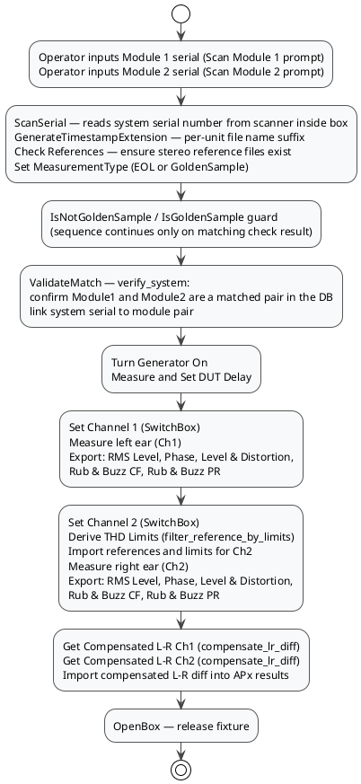

# H715 System Test — APx Sequence Walkthrough

This document describes what happens in `H715System_Test_v_2_0_DV2.approjx` and `H715_ModuleMatching_v_1_0_DV2.approjx`, based on the `project.xml` sequence and shell-step definitions inside each `.approjx` ZIP package.

## Scope

- Project packages: `H715System_Test_v_2_0_DV2.approjx`, `H715_ModuleMatching_v_1_0_DV2.approjx`
- Source analyzed: `project.xml` inside each `.approjx` ZIP
- Focus:
  - execution sequence at high level
  - shell commands in document order with full arguments
  - APx variable use and output handling
  - measurement and export flow
  - L-R compensation path

The operator-facing procedure is documented separately in [H715_system_test_SOP.md](H715_system_test_SOP.md).

---

## Project 1 — Module Matching (`H715_ModuleMatching_v_1_0_DV2.approjx`)

### Purpose

Measures a single driver module's frequency response and stores it in the matcher database. Run once per module before assembly. The sequence loops automatically to allow back-to-back measurements.

### High-Level Runtime Flow

1. Operator inputs serial number at prompt (APx `PromptStep`).
2. Init: timestamp, references, measurement type (`EOL` or `GoldenSample`).
3. Guard: validate golden-sample/non-golden state.
4. APx acoustic measurement (single channel, mono fixture).
5. Export to temporary matching CSV.
6. Upload to `Matching_App\Data\db\matcher.db` (`upload_measurement`).

### Shell Commands in Sequence Order

| # | Step name | Command and arguments | Wait mode | Output handling |
|---|---|---|---|---|
| 1 | *(serial input)* | `pythonw.exe -c "print('EOL')"` — via operator prompt step | `WaitForExitStoreOutputInVariable` | `MeasurementType = EOL` |
| 2 | `GetTimestampExtension` | `pythonw.exe adam_workstation.py generate_timestamp_extension` | `WaitForExitStoreOutputInVariable` | `TimestampExtension = <timestamp>` |
| 3 | `Check References` | `pythonw.exe adam_workstation.py setup_references "$(MyDocuments)\$(DataDirectory)" --mono` | `WaitForExitIgnoreResponse` | Output ignored |
| 4 | `Set EOL` | `pythonw.exe -c "print('EOL')"` | `WaitForExitStoreOutputInVariable` | `MeasurementType = EOL` |
| 5 | `Is not Golden Sample` | `pythonw.exe adam_workstation.py is_golden_sample $(SerialNumber) $(GoldenSampleSerial) False` | `WaitForExitValidateResponse` | Expects `False` |
| 6 | `Set Golden Sample` | `pythonw.exe -c "print('GoldenSample')"` | `WaitForExitStoreOutputInVariable` | `MeasurementType = GoldenSample` |
| 7 | `Is Golden Sample` | `pythonw.exe adam_workstation.py is_golden_sample $(SerialNumber) $(GoldenSampleSerial) True` | `WaitForExitValidateResponse` | Expects `True` |
| 8 | `StoreMatchingData` | `pythonw.exe adam_workstation.py upload_measurement "$(MyDocuments)\$(DataDirectory)\Temp\Matching_RMS.csv" -s $(SerialNumber) --write-db --db-path Matching_App\Data\db\matcher.db` | `DoNotWait` | Not captured |

> Steps 4–5 are the EOL path; steps 6–7 are the Golden Sample path. Only one path runs per unit, controlled by the APx checklist mode.

> `StoreMatchingData` uses `DoNotWait` — APx does not block on the DB write, allowing the sequence to loop back to the next operator prompt immediately.

### Checklist Sequences

| Sequence | Active by default | Purpose |
|---|---|---|
| EOL | Yes | Standard production module measurement |
| Golden Sample | No | Reference measurement under golden-sample mode |

---

## Project 2 — System Test (`H715System_Test_v_2_0_DV2.approjx`)

### Purpose

Tests the fully assembled H715 headphone. Validates that the two installed driver modules form a confirmed matched pair, measures both channels against limits, and computes L-R compensation for downstream reference use.

### High-Level Runtime Flow



### Shell Commands in Sequence Order

The shell steps below appear in document order as extracted from `project.xml`. The init group (steps 7–14) runs at the beginning of the APx sequence before any measurements. The measurement group (steps 1–6) runs after the acoustic measurements are complete.

#### Init Group — Runs Before Measurements

| # | Step name | Command and arguments | Wait mode | Output handling |
|---|---|---|---|---|
| 7 | `ScanSerial` | `pythonw.exe adam_workstation.py scan_serial` | `WaitForExitStoreOutputInVariable` | `SerialNumber = <scanned>` |
| 8 | `Validate Match` | `pythonw.exe adam_workstation.py verify_system $(SerialNumber) $(Module1Serial) $(Module2Serial)` | `WaitForExitValidateResponse` | Expects `True` |
| 9 | `IsNotGoldenSample` | `pythonw.exe adam_workstation.py is_golden_sample $(SerialNumber) $(GoldenSampleSN) False` | `WaitForExitValidateResponse` | Expects `False` (EOL path) |
| 10 | `IsGoldenSample` | `pythonw.exe adam_workstation.py is_golden_sample $(SerialNumber) $(GoldenSampleSN) True` | `WaitForExitValidateResponse` | Expects `True` (Golden Sample path) |
| 11 | `GetTimestampExtension` | `pythonw.exe adam_workstation.py generate_timestamp_extension` | `WaitForExitStoreOutputInVariable` | `TimestampExtension = <timestamp>` |
| 12 | `Check References` | `pythonw.exe adam_workstation.py setup_references "$(MyDocuments)\$(DataDirectory)"` | `WaitForExitIgnoreResponse` | Output ignored |
| 13 | `Set EOL` | `pythonw.exe -c "print('EOL')"` | `WaitForExitStoreOutputInVariable` | `MeasurementType = EOL` |
| 14 | `Set Golden Sample` | `pythonw.exe -c "print('GoldenSample')"` | `WaitForExitStoreOutputInVariable` | `MeasurementType = GoldenSample` |

#### Measurement Group — Runs During and After Acoustic Measurements

| # | Step name | Command and arguments | Wait mode | Output handling |
|---|---|---|---|---|
| 1 | `Set Channel 1` | `pythonw.exe adam_workstation.py set_channel 1` | `WaitForExitValidateResponse` | Expects `Channel set to 1` |
| 2 | `Set Channel 2` | `pythonw.exe adam_workstation.py set_channel 2` | `WaitForExitValidateResponse` | Expects `Channel set to 2` |
| 3 | `Derive THD Limits` | `pythonw.exe adam_workstation.py filter_reference_by_limits "$(MyDocuments)\$(DataDirectory)\References\$(MeasurementType)\THD.csv" "$(MyDocuments)\$(DataDirectory)\References\$(MeasurementType)\Limits\THD.csv" --output-filename "THD_Lim.csv" --output-dir "$(MyDocuments)\$(DataDirectory)\Temp"` | `WaitForExitValidateResponse` | Expects `successful` |
| 4 | `Get Compensated L-R Ch1` | `pythonw.exe adam_workstation.py compensate_lr_diff "$(MyDocuments)\$(DataDirectory)\$(MeasurementsDirectory)\$(MeasurementType)\$(Year)\$(Month)_$(Day)\$(SerialNumber)_$(TimestampExtension)_RMS_Level_Ch_1.csv" "$(MyDocuments)\$(DataDirectory)\References\L-R-Diff.csv" "$(MyDocuments)\$(DataDirectory)\Temp\Ch1_comp.csv"` | `WaitForExitIgnoreResponse` | Output ignored |
| 5 | `Get Compensated L-R Ch2` | `pythonw.exe adam_workstation.py compensate_lr_diff "$(MyDocuments)\$(DataDirectory)\$(MeasurementsDirectory)\$(MeasurementType)\$(Year)\$(Month)_$(Day)\$(SerialNumber)_$(TimestampExtension)_RMS_Level_Ch_2.csv" "$(MyDocuments)\$(DataDirectory)\References\L-R-Diff.csv" "$(MyDocuments)\$(DataDirectory)\Temp\Ch2_comp.csv"` | `WaitForExitIgnoreResponse` | Output ignored |
| 6 | `OpenBox` | `pythonw.exe adam_workstation.py open_box` | `WaitForExitIgnoreResponse` | Output ignored |

### Full Sequence Step Order

This reflects the actual order of steps in `project.xml`, combining APx-native steps and shell steps:

| Position | Step type | Name | Notes |
|---|---|---|---|
| 1 | `PromptStep` | Scan Module 1 | Operator inputs `Module1Serial` |
| 2 | `PromptStep` | Scan Module 2 | Operator inputs `Module2Serial` |
| 3 | `ShellStep` | ScanSerial | Reads `SerialNumber` from scanner in fixture |
| 4 | `ShellStep` | Validate Match | Checks matched pair; records system build |
| 5 | `ShellStep` | IsNotGoldenSample / IsGoldenSample | Checklist-driven branch |
| 6 | `ShellStep` | GetTimestampExtension | Sets `TimestampExtension` |
| 7 | `ShellStep` | Check References | Ensures stereo reference files exist |
| 8 | `ShellStep` | Set EOL / Set Golden Sample | Sets `MeasurementType` |
| 9 | `EnableGeneratorStep` | Turn Generator On | APx generator enabled |
| 10 | `SetDeviceDelayStep` | Measure and Set DUT Delay | APx latency compensation |
| 11 | `MeasurementStep` | *(Ch1 measurement)* | Left ear acoustic measurement |
| 12 | `ShellStep` | Set Channel 1 | SwitchBox → Ch 1 |
| 13 | `LoadCustomDataStep` | Refresh Defined Result(s) | APx result refresh |
| 14 | `ExportResultDataStep` | Export RMS Level | Ch1 RMS CSV |
| 15 | `ExportResultDataStep` | Export Phase | Ch1 Phase CSV |
| 16 | `ExportResultDataStep` | Export Level and Distortion | Ch1 THD CSV |
| 17 | `ExportResultDataStep` | Export Rub and Buzz CF | Ch1 RnB Crest Factor CSV |
| 18 | `ExportResultDataStep` | Export Rub and Buzz PR | Ch1 RnB Peak Ratio CSV |
| 19 | `EnableGeneratorStep` | Generate | APx generator re-enabled |
| 20 | `SaveGeneratorWaveformStep` | Save Generator Waveform | APx waveform save |
| 21 | `MeasurementStep` | *(Ch2 measurement)* | Right ear acoustic measurement |
| 22 | `ShellStep` | Set Channel 2 | SwitchBox → Ch 2 |
| 23 | `ShellStep` | Derive THD Limits | `filter_reference_by_limits` → `Temp\THD_Lim.csv` |
| 24 | `ImportResultDataStep` | Import Reference (×3) | Ch2 RMS, Phase, THD references |
| 25 | `ImportLimitsDataStep` | Import Limits (×5) | Ch2 limits (upper/lower for each measurand) |
| 26 | `MeasurementStep` | *(Ch2 result)* | APx result computation |
| 27 | `LoadCustomDataStep` | Refresh Defined Result(s) | APx result refresh |
| 28 | `ExportResultDataStep` | Export RMS Level | Ch2 RMS CSV |
| 29 | `ExportResultDataStep` | Export Phase | Ch2 Phase CSV |
| 30 | `ExportResultDataStep` | Export Result Data | Ch2 THD CSV |
| 31 | `ExportResultDataStep` | Export Rub and Buzz CF | Ch2 RnB Crest Factor CSV |
| 32 | `ExportResultDataStep` | Export Rub and Buzz PR | Ch2 RnB Peak Ratio CSV |
| 33 | `ShellStep` | Get Compensated L-R Ch1 | `compensate_lr_diff` → `Temp\Ch1_comp.csv` |
| 34 | `ShellStep` | Get Compensated L-R Ch2 | `compensate_lr_diff` → `Temp\Ch2_comp.csv` |
| 35 | `ImportResultDataStep` | Import L-R-Diff Compensated CH1 (×2) | Ch1 compensated diff into APx |
| 36 | `ShellStep` | OpenBox | Releases fixture lid |

### Checklist Sequences

| Sequence | Active by default | Purpose |
|---|---|---|
| EOL | Yes | Normal production test; `MeasurementType = EOL` |
| Golden Sample | No | Reference measurement; `MeasurementType = GoldenSample` |
| CalibrationL | No | Sets Ch1 SPL reference using calibration microphone |
| CalibrationR | No | Sets Ch2 SPL reference using calibration microphone |

---

## L-R Compensation — How It Works

The `compensate_lr_diff` command adjusts each channel's RMS level measurement by half the L-R imbalance recorded in `References\L-R-Diff.csv`:

$$L_{new} = L + 0.5 \times \text{diff}$$
$$R_{new} = R - 0.5 \times \text{diff}$$

This accounts for systematic microphone position or sensitivity differences between the left and right measurement channels. The compensated CSVs are written to `Temp\` and imported back into APx as reference overlays.

---

## APx Project Variables

### Module Matching (`H715_ModuleMatching_v_1_0_DV2.approjx`)

| Variable | Set by | Purpose |
|---|---|---|
| `DataDirectory` | Project setting | Root data folder |
| `MeasurementsDirectory` | Project setting | Sub-folder for CSVs |
| `GoldenSampleSerial` | Project setting | Serial of the designated golden-sample module |
| `SerialNumber` | Operator prompt (PromptStep) | Current module serial number |
| `TimestampExtension` | `generate_timestamp_extension` | Per-unit filename suffix |
| `MeasurementType` | `Set EOL` / `Set Golden Sample` shell step | `EOL` or `GoldenSample` |

### System Test (`H715System_Test_v_2_0_DV2.approjx`)

| Variable | Set by | Purpose |
|---|---|---|
| `DataDirectory` | Project setting | Root data folder |
| `MeasurementsDirectory` | Project setting | Sub-folder for CSVs |
| `GoldenSampleSN` | Project setting | Serial of the designated golden-sample headphone |
| `Module1Serial` | Operator prompt (Scan Module 1) | Left driver module serial |
| `Module2Serial` | Operator prompt (Scan Module 2) | Right driver module serial |
| `SerialNumber` | `scan_serial` (ScanSerial shell step) | System serial number scanned from fixture |
| `TimestampExtension` | `generate_timestamp_extension` | Per-unit filename suffix |
| `MeasurementType` | `Set EOL` / `Set Golden Sample` shell step | `EOL` or `GoldenSample` |
| `Year` / `Month` / `Day` | APx built-in | Date path components |

---

## Measurands and Result Families

### Module Matching

| Measurand | Export |
|---|---|
| RMS Level (mono) | `Temp\Matching_RMS.csv` — uploaded to matcher DB |

### System Test — Both Channels

| Measurand | Channel |
|---|---|
| RMS Level | Ch1, Ch2 |
| Phase (vs frequency) | Ch1, Ch2 |
| Level and Distortion (THD) | Ch1, Ch2 |
| Rub and Buzz Crest Factor | Ch1, Ch2 |
| Rub and Buzz Peak Ratio | Ch1, Ch2 |
| L-R Diff Compensated (imported) | Ch1 only (imported from Temp) |

---

## Key Exported Files

### Module Matching

```
$(MyDocuments)\$(DataDirectory)\Temp\
  Matching_RMS.csv                         ← uploaded to matcher.db
```

### System Test

```
$(MyDocuments)\$(DataDirectory)\$(MeasurementsDirectory)\$(MeasurementType)\$(Year)\$(Month)_$(Day)\
  $(SerialNumber)_$(TimestampExtension)_RMS_Level_Ch_1.csv
  $(SerialNumber)_$(TimestampExtension)_Phase_Ch_1.csv
  $(SerialNumber)_$(TimestampExtension)_Level_Distortion_Ch_1.csv
  $(SerialNumber)_$(TimestampExtension)_RnB_CF_Ch_1.csv
  $(SerialNumber)_$(TimestampExtension)_RnB_PR_Ch_1.csv
  $(SerialNumber)_$(TimestampExtension)_RMS_Level_Ch_2.csv
  $(SerialNumber)_$(TimestampExtension)_Phase_Ch_2.csv
  $(SerialNumber)_$(TimestampExtension)_Level_Distortion_Ch_2.csv
  $(SerialNumber)_$(TimestampExtension)_RnB_CF_Ch_2.csv
  $(SerialNumber)_$(TimestampExtension)_RnB_PR_Ch_2.csv

$(MyDocuments)\$(DataDirectory)\Temp\
  THD_Lim.csv                              ← filter_reference_by_limits output
  Ch1_comp.csv                             ← compensate_lr_diff Ch1 output
  Ch2_comp.csv                             ← compensate_lr_diff Ch2 output
```

---

## Related

| File | Role |
|---|---|
| [H715_system_test_SOP.md](H715_system_test_SOP.md) | Operator procedure (step-by-step with screenshots) |
| [matching-system.md](matching-system.md) | Matcher DB schema, pairing algorithm, verify_system |
| [csv-and-measurements.md](csv-and-measurements.md) | CSV format, L-R compensation, reference filtering |
| [hardware-integration.md](hardware-integration.md) | SwitchBox set_channel and open_box behavior |
| [workstation-cli-reference.md](workstation-cli-reference.md) | All workstation commands used in this project |
