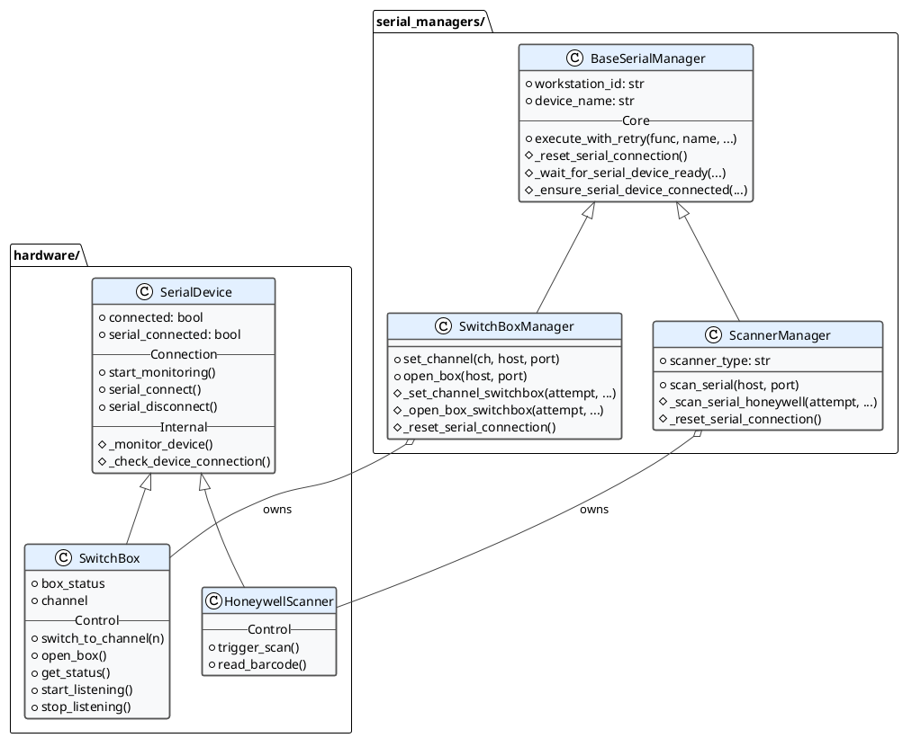
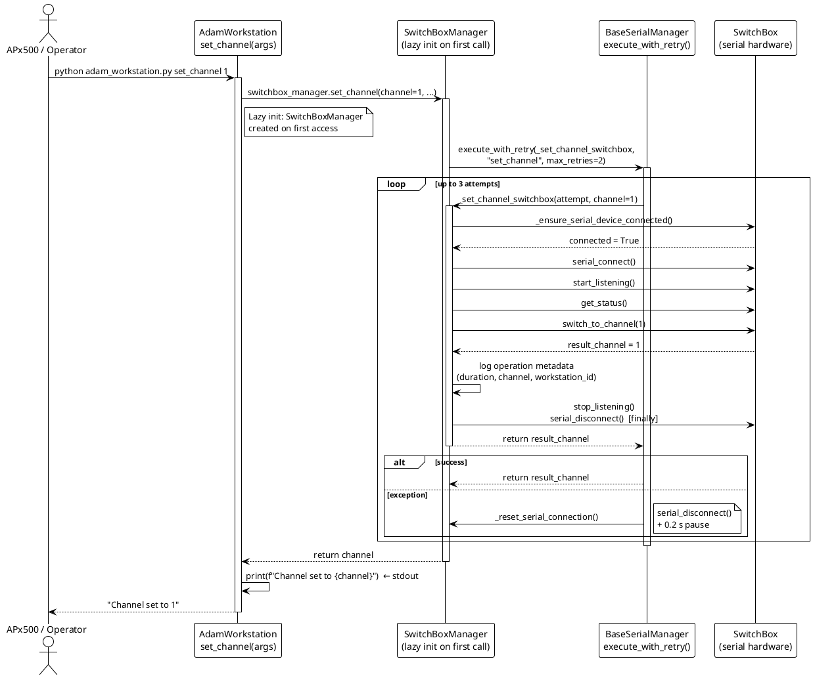

# Hardware Integration

## Design and Role

The production workstation controls local serial hardware through two explicit layers: the [../hardware](../hardware) package (device-level protocol) and the [../serial_managers](../serial_managers) package (production-stability layer). Neither layer is optional — together they ensure that hardware failures surface as controlled stdout output rather than raw tracebacks in APx shell steps.

Hardware managers are initialized **lazily** by [../adam_workstation.py](../adam_workstation.py). The CLI can start, run helper commands, OCA commands, and CSV processing without any serial device connected. The first time a hardware command (`set_channel`, `open_box`, `scan_serial`) is called, the relevant manager is created and the physical device is detected.

## Class Hierarchy



## The Two-Layer Pattern

| Layer | Package | Responsibility |
|---|---|---|
| **Hardware** | `hardware/` | USB/serial identification, physical connection monitoring, device-specific byte-level protocol (commands, responses, listener threads). |
| **Manager** | `serial_managers/` | Retry loop, connection reset between attempts, thread lock, production log forwarding. Keeps CLI handlers small. |

This separation means:
- Adding support for a new device only requires a new `hardware/` class and a new `serial_managers/` class. The CLI handler stays simple.
- Connection instability, timing races, and transient serial errors are handled once in `BaseSerialManager.execute_with_retry`, not scattered across CLI handlers.

## Why Managers Exist

Without the manager layer, every CLI command would need its own implementation of:
1. Retry on transient serial failure
2. Serial reconnect / reset between attempts
3. Thread lock to prevent overlapping serial access
4. Structured log forwarding to the workstation logger
5. Consistent `Error: ...` stdout on failure

The manager layer centralizes all of this. The CLI handler in `adam_workstation.py` calls one manager method and prints the result.

## Command Execution Flow

The following sequence diagram shows the full path for a typical hardware command such as `set_channel`. All hardware commands (`open_box`, `scan_serial`) follow the identical pattern.



## Connection and Physical Monitoring

`SerialDevice` (the base class for all hardware) starts a background **monitor thread** on instantiation. This thread continuously polls for the device's USB vendor ID and product ID using `serial.tools.list_ports`. When the device appears or disappears, `on_connect` / `on_disconnect` callbacks fire.

The manager layer registers these callbacks to update its internal state. This means:
- A device that is unplugged during a retry loop will be detected before the next attempt.
- `_ensure_serial_device_connected` can distinguish between "device not seen at all" and "device seen but serial port not yet opened".

Connection state tracking uses two flags:

| Flag | Meaning |
|---|---|
| `connected` | Device is physically present (USB detection). |
| `serial_connected` | A serial port connection is currently open. |

The manager calls `serial_connect()` before each operation and `serial_disconnect()` in the `finally` block. This open-per-operation pattern prevents stale port state from accumulating across retry attempts.

## Hardware Classes

### `SerialDevice` — [../hardware/serial_device.py](../hardware/serial_device.py)

Shared foundation for all serial devices. Provides:
- Background USB monitoring thread (`_monitor_device`)
- `serial_connect()` / `serial_disconnect()` — open and close the port by matching vendor ID and product ID
- `connected` / `serial_connected` flags
- Thread lock (`_lock`) for serial access

New device classes subclass `SerialDevice` and add device-specific commands.

### `SwitchBox` — [../hardware/switchbox.py](../hardware/switchbox.py)

USB relay controller for audio signal routing. Key behaviors:
- `switch_to_channel(n)` — sends channel-select byte sequence and waits for confirmation
- `open_box()` / `get_status()` — box-state control and status queries
- `start_listening()` / `stop_listening()` — background thread for inbound status messages from the box
- USB identification: vendor ID `0x2E8A`, product ID `0x000A`

### `HoneywellScanner` — [../hardware/honeywell_scanner.py](../hardware/honeywell_scanner.py)

USB barcode scanner (Honeywell series). Key behaviors:
- `trigger_scan()` — sends the software-trigger byte sequence
- `read_barcode()` — reads the response line from the serial port
- Identified by Honeywell USB vendor and product IDs

## Manager Classes

### `BaseSerialManager` — [../serial_managers/base_serial_manager.py](../serial_managers/base_serial_manager.py)

All managers extend this class. Core behavior:

| Method | Behavior |
|---|---|
| `execute_with_retry(func, name, max_retries=2, ...)` | Calls `func(attempt, ...)` up to `max_retries + 1` times. On failure between attempts: logs warning, calls `_reset_serial_connection()`, waits `retry_delay` seconds. On final failure: logs error and re-raises. |
| `_reset_serial_connection()` | Override in subclass. Default logs a debug note. Called between retry attempts to clear stale state. |
| `_wait_for_serial_device_ready(device, type, timeout=5)` | Polls `device.connected` until true or timeout. Called during manager `__init__`. |
| `_ensure_serial_device_connected(device, type, max_checks=3)` | Multi-check connection guard before each operation attempt. |

### `SwitchBoxManager` — [../serial_managers/switchbox_manager.py](../serial_managers/switchbox_manager.py)

| Method | Behavior |
|---|---|
| `set_channel(channel, host, port)` | Validates channel in `{1, 2}`, then delegates via `execute_with_retry`. |
| `open_box(host, port)` | Opens box and returns status via `execute_with_retry`. |
| `_reset_serial_connection()` | `serial_disconnect()` + 0.2 s sleep. |

All operations use `switchbox_lock` to prevent concurrent serial access.

### `ScannerManager` — [../serial_managers/scanner_manager.py](../serial_managers/scanner_manager.py)

| Method | Behavior |
|---|---|
| `scan_serial(host, port)` | Triggers scan and reads barcode via `execute_with_retry`. |
| `_reset_serial_connection()` | `serial_disconnect()` + 0.2 s sleep. |
| `scanner_type` | Currently `"honeywell"`. Resolved to `HoneywellScanner` at init. |

## Lazy Initialization in the Workstation

`AdamWorkstation` exposes hardware managers as Python `@property` descriptors. The manager object is created exactly once, on first access:

```python
@property
def switchbox_manager(self):
    if self._switchbox_manager is None:
        from serial_managers import SwitchBoxManager
        self._switchbox_manager = SwitchBoxManager(self.workstation_id)
    return self._switchbox_manager
```

This means `SwitchBoxManager.__init__` (which waits for USB detection) runs only when a `set_channel` or `open_box` command is actually executed — not at CLI startup. APx projects that call many helper or OCA commands before any hardware command do not pay the USB detection cost.

---

## Workstation Commands

| Command | Args | Stdout | APx pattern |
|---|---|---|---|
| `set_channel` | `1` or `2` | `Channel set to 1` / `Channel set to 2` or `Error: ...` | `ExpectedResponse` validation. |
| `open_box` | none | `Box status: <status>` or `Error: ...` | Output often ignored. |
| `scan_serial` | none | Scanned serial number or `NaN` | `ProgramOutputVariable` store. |

The parser accepts only `1` and `2` as channel values. Documentation or APx projects that reference additional channel numbers are stale for the current hardware and parser.

### APx Shell Step Examples

Channel routing with validation:

```xml
<Command>pythonw.exe</Command>
<Arguments>adam_workstation.py set_channel 1</Arguments>
<WaitForExit>WaitForExitValidateResponse</WaitForExit>
<ExpectedResponse>Channel set to 1</ExpectedResponse>
```

Serial number capture:

```xml
<Command>pythonw.exe</Command>
<Arguments>adam_workstation.py scan_serial</Arguments>
<WaitForExit>WaitForExitStoreResponse</WaitForExit>
<ProgramOutputVariable>SerialNumber</ProgramOutputVariable>
```

The scanner command is a value getter. Use `ProgramOutputVariable`, not `ExpectedResponse`, unless a fixed test barcode is intentionally in use.

---

## Adding New Hardware

Adding a new serial device follows three steps.

### Step 1 — Hardware class

Create `hardware/my_device.py` subclassing `SerialDevice`. Provide the USB vendor ID and product ID for USB detection. Implement device-specific command methods.

```python
# hardware/my_device.py
from .serial_device import SerialDevice

class MyDevice(SerialDevice):
    def __init__(self, on_connect=None, on_disconnect=None):
        super().__init__(
            baudrate=9600,
            vendor_id=0xXXXX,
            product_id=0xYYYY,
            on_connect=on_connect,
            on_disconnect=on_disconnect,
        )

    def do_thing(self):
        """Send command and return response."""
        self.serial_connection.write(b"\x01\x02")
        return self.serial_connection.readline().decode().strip()
```

Export the class from `hardware/__init__.py`.

### Step 2 — Manager class

Create `serial_managers/my_device_manager.py` subclassing `BaseSerialManager`. Wrap each public operation in `execute_with_retry` and override `_reset_serial_connection`.

```python
# serial_managers/my_device_manager.py
import threading, time
from .base_serial_manager import BaseSerialManager
from hardware import MyDevice

class MyDeviceManager(BaseSerialManager):
    def __init__(self, workstation_id):
        super().__init__(workstation_id, "MyDevice")
        self._lock = threading.Lock()
        self.device = MyDevice(
            on_connect=self._on_connect,
            on_disconnect=self._on_disconnect,
        )
        self._wait_for_serial_device_ready(self.device, "MyDevice")

    def _on_connect(self): ...
    def _on_disconnect(self): ...

    def _reset_serial_connection(self):
        try:
            with self._lock:
                self.device.serial_disconnect()
                time.sleep(0.2)
        except Exception:
            pass

    def do_thing(self, host=None, port=65432):
        return self.execute_with_retry(self._do_thing_impl, "do_thing",
                                       host=host, port=port)

    def _do_thing_impl(self, attempt, host=None, port=65432):
        if not self._ensure_serial_device_connected(self.device, "MyDevice"):
            raise Exception("MyDevice not connected")
        with self._lock:
            self.device.serial_connect()
            result = self.device.do_thing()
            self.device.serial_disconnect()
        return result
```

Export the class from `serial_managers/__init__.py`.

### Step 3 — Workstation command

Add a lazy `@property`, a CLI handler method, and entries in `command_map` and the parser. Follow the same pattern as `switchbox_manager` and `set_channel`.

---

## Failure Behavior

| Command | On hardware exception | Why |
|---|---|---|
| `set_channel` | Prints `Error: <detail>`, exits 1. Shows error popup if tkinter is available. | APx `ExpectedResponse` check fails cleanly. |
| `open_box` | Prints `Error: <detail>`, exits 1. | Same. |
| `scan_serial` | Logs exception, prints `NaN`. Shows error popup. | APx stores `NaN` — downstream logic can detect the failed scan without a raw traceback appearing in the test report. |

All retry attempts are logged. Only the final state (success or last error) reaches stdout.

## Logging

Hardware operations are logged to `logs/adam_audio/adam_workstation_log_YYYY-MM-DD.log`. Log entries include attempt number, duration, device name, channel/result, and workstation ID. Nothing from the manager or hardware layer touches stdout — that contract belongs to the CLI handler in `adam_workstation.py` exclusively.

---

## Troubleshooting Checklist

1. Confirm the device appears in Windows Device Manager and is not held open by another process (e.g. a previous Python process that did not exit cleanly).
2. Run the command directly from PowerShell in the repository root to see raw output.
3. Check `logs/adam_audio/adam_workstation_log_YYYY-MM-DD.log` for retry attempts, connection events, and error details.
4. For APx-only failures, compare `ExpectedResponse` in the APx project with the stdout shown by the same command run in PowerShell.
5. `scan_serial` printing `NaN` — check serial connection, verify scanner type in `--scanner-type`, and inspect the raw barcode content.
6. Manager init hangs — USB device not detected within the 5 s `_wait_for_serial_device_ready` timeout. Check USB cable and driver.