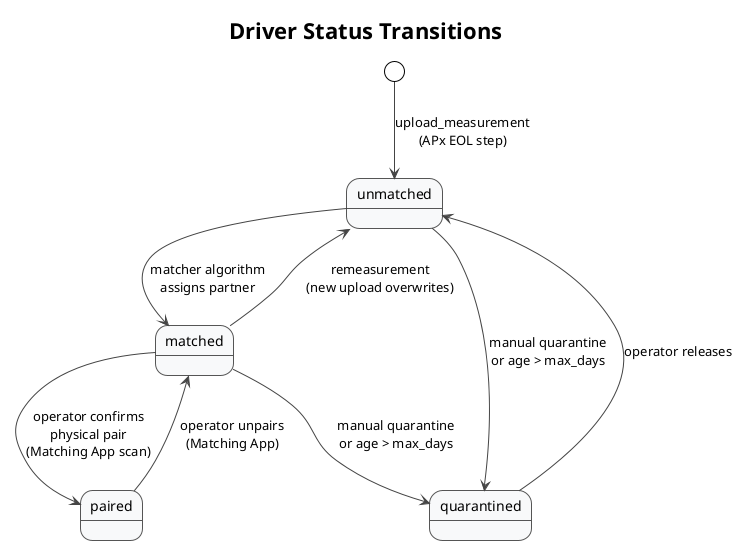

# Matching System

The matching system pairs left and right driver modules based on measured frequency responses. It consists of APx measurement upload, a SQLite database, a Tkinter operator GUI, and a system-build verification command.

Operator usage is documented in [../Matching_App/docs/H600_Matching_User_Guide.md](../Matching_App/docs/H600_Matching_User_Guide.md). This document focuses on the developer and integration view.

## Main Files

| File | Responsibility |
|---|---|
| [../Matching_App/run.py](../Matching_App/run.py) | GUI launcher. |
| [../Matching_App/app/main.py](../Matching_App/app/main.py) | Tkinter application shell and workflow. |
| [../Matching_App/app/database.py](../Matching_App/app/database.py) | SQLite schema, settings, driver status transitions, export helpers. |
| [../Matching_App/app/matcher.py](../Matching_App/app/matcher.py) | Pairing algorithm using SciPy's Hungarian assignment. |
| [../Matching_App/app/watcher.py](../Matching_App/app/watcher.py) | Database polling / change detection support. |
| [../analysis/measurement_upload.py](../analysis/measurement_upload.py) | APx measurement upload into matcher DB. |

## Database

Default path:

```text
Matching_App/Data/db/matcher.db
```

Tables created by the application/upload path:

| Table | Purpose |
|---|---|
| `frequency_vector` | Shared frequency vector for measurements. Single row with `id = 1`. |
| `drivers` | One row per measured driver/module. Stores serial, side, levels JSON, status, partner, load/match timestamps. |
| `system_builds` | Links final system serials to two installed module serials. |

Settings are stored as JSON next to the DB:

```text
Matching_App/Data/db/settings.json
```

Default settings include RMSE threshold `1.0`, frequency range `200` to `8000` Hz, PIN `1234`, and maximum module age `14` days.

## Driver Status Model

| Status | Meaning |
|---|---|
| `unmatched` | In the pool and available for pairing. |
| `matched` | Algorithm has assigned a partner, but the physical pair has not been confirmed. |
| `paired` | Operator scanned both assigned modules and confirmed the physical pair. |
| `quarantined` | Removed from active matching, manually or by age rule. |

Remeasurement is allowed for `unmatched` and `matched` rows. `paired` rows are locked and must be unpaired before a new measurement can overwrite them.



## Measurement Upload

APx projects call:

```powershell
pythonw.exe adam_workstation.py upload_measurement "<measurement.csv>" -s $(SerialNumber) --write-db --db-path Matching_App\Data\db\matcher.db
```

The command prints `True` when the DB write succeeds and `False` when it fails.

Accepted serial prefixes:

| Prefix | Side |
|---|---|
| `IA` | left |
| `IB` | right |

The upload path parses channel `Ch1`, stores levels as JSON, and stores the frequency vector if one does not already exist.

## Pairing Algorithm

[../Matching_App/app/matcher.py](../Matching_App/app/matcher.py) computes pairs from all `unmatched` left and right drivers:

1. Load left and right unmatched rows.
2. Decode levels JSON.
3. Group drivers by number of frequency points so incompatible measurements are not compared.
4. Optionally filter levels by the configured frequency range.
5. Build an RMSE cost matrix between every left/right combination.
6. Run `scipy.optimize.linear_sum_assignment` to find the globally optimal assignment.
7. Store pairs whose RMSE is at or below the configured threshold.

RMSE is calculated as:

$$
RMSE = \sqrt{\frac{1}{N}\sum_{i=1}^{N}(L_i - R_i)^2}
$$

## System Build Verification

APx EOL projects can verify that the two installed modules are a valid matched pair:

```powershell
pythonw.exe adam_workstation.py verify_system $(SerialNumber) $(Module1Serial) $(Module2Serial)
```

Expected stdout on success is `True`. On failure, the command prints a human-readable error string. The command also records the system build in `system_builds` when verification succeeds.

## Database Synchronization

The existing user guide contains operational guidance for sharing and transferring the database between stations. The key technical rules are:

- avoid concurrent writes from multiple processes to the same copied DB;
- keep paired rows locked unless deliberately unpaired;
- back up the DB before manual repair or transfer;
- use the app/export tools where possible instead of editing SQLite manually.