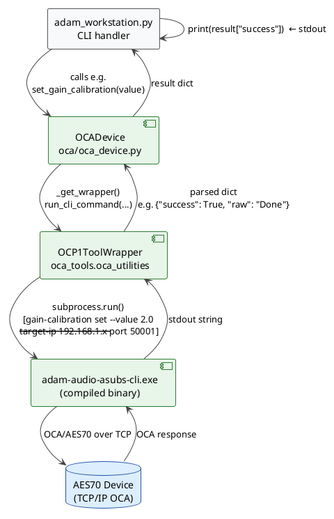
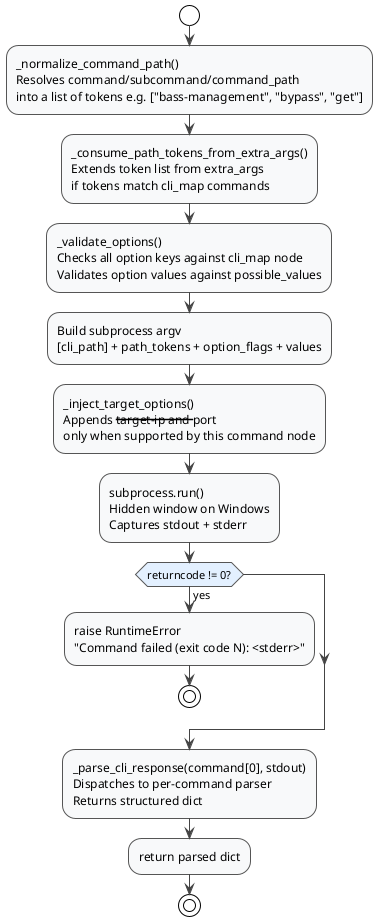

# OCP1ToolWrapper

`oca_tools.oca_utilities.OCP1ToolWrapper` is the Python layer that translates high-level OCA device operations into subprocess calls to the **ADAM Audio A-Subs CLI binary** (`adam-audio-asubs-cli.exe`). It is the lowest-level component in the OCA communication stack and the only place where network traffic to AES70-compliant devices originates.

## Position in the Stack



## Package Versions

Two versions of `oca_tools` are installed in the venv:

| Package | Path | CLI Binary | API |
|---|---|---|---|
| `oca-tools` (legacy) | `.venv/src/oca-tools/` | `aes70-cli.exe` | `send_command(args: list)` — low-level |
| `adam-audio-tools` (active) | `.venv/src/adam-audio-tools/` | `adam-audio-asubs-cli.exe` | `run_cli_command(...)` — structured |

`oca_device.py` calls `run_cli_command`, so the **adam-audio-tools** version is the active one. The legacy `send_command` API is not used by production code.

---

## The CLI Binary

The binary `adam-audio-asubs-cli.exe` is a compiled native executable shipped inside the `oca_tools` package directory. It implements the AES70/OCA protocol and communicates with devices over TCP.

### Top-Level Commands

```
adam-audio-asubs-cli.exe [COMMAND]

  discover             Discover and list compatible devices on the network
  model-description    Get the model description (manufacturer, model, firmware version)
  mode                 Get / set / monitor the control mode
  audio-input    (APP) Get / set / monitor the audio input mode
  bass-management(APP) Bass management subcommands (mode, bypass)
  crossover-freq (APP) Get / set / monitor crossover frequency
  gain           (APP) Get / set / monitor gain value
  mute           (APP) Get / set / monitor mute state
  phase-delay    (APP) Get / set / monitor phase delay position
  user-filters   (APP) Get / set / monitor user filters
  firmware             Firmware management subcommands (update)
  gain-calibration(EOL)Get / set / monitor gain calibration
  factory-settings(EOL)Factory settings subcommands (serial number, MAC, lock/unlock)
  sound-id             Sound ID file operations
```

`(APP)` — available in application mode. `(EOL)` — end-of-line provisioning commands requiring factory-settings unlock.

The binary is resolved relative to `oca_utilities.py` at runtime and executed as a subprocess. On Windows, the console window is suppressed via `STARTF_USESHOWWINDOW`.

---

## `OCP1ToolWrapper.__init__`

```python
OCP1ToolWrapper(target_ip=None, port=None, cli_path=None)
```

| Parameter | Meaning |
|---|---|
| `target_ip` | IPv4 address of the OCA device. `None` for name-based targeting (injected via `--target`). |
| `port` | TCP port of the OCA device. Default device port is `50001`. |
| `cli_path` | Path to CLI binary. Defaults to `adam-audio-asubs-cli.exe` next to `oca_utilities.py`. |

On init the wrapper also loads `cli_map.json` (if present) into `self.cli_map`. The map is used for option validation and `--target-ip` / `--port` injection. If no map is found, validation is skipped and commands run without it.

---

## `run_cli_command` — The Core Method

```python
run_cli_command(
    command=None,
    subcommand=None,
    options=None,
    extra_args=None,
    command_path=None
) -> dict | str
```

This is the only public method called by `OCADevice`. It assembles a subprocess call from the provided arguments, executes the binary, and returns a parsed Python dict.

### Execution Pipeline



### Command Path Normalization

Three equivalent ways to express `gain-calibration set --value 2.0`:

```python
# 1. Legacy keyword API
run_cli_command(command="gain-calibration", subcommand="set", options={"--value": 2.0})

# 2. command_path as list
run_cli_command(command_path=["gain-calibration", "set"], options={"--value": 2.0})

# 3. command_path as string
run_cli_command(command_path="gain-calibration set", options={"--value": 2.0})
```

All three produce the same CLI argv: `["adam-audio-asubs-cli.exe", "gain-calibration", "set", "--value", "2.0", "--target-ip", "192.168.1.x", "--port", "50001"]`

### Option Handling

`options` is a `dict` mapping CLI flags to values:

```python
options = {
    "--value": 2.0,           # single value  → "--value 2.0"
    "--coefficients": [1, 2]  # list          → "--coefficients 1 2"
}
```

`None` values emit only the flag (useful for boolean flags). The order of keys in the dict determines argument order.

### `--target-ip` and `--port` Injection

The wrapper does **not** unconditionally append `--target-ip` and `--port`. It checks via `cli_map.json` whether the resolved command node actually accepts those flags. Commands like `discover` do not use a fixed IP, so the injection is skipped for them. This prevents "unexpected argument" errors from the CLI binary.

---

## Response Parsing

Every `run_cli_command` call dispatches to a per-command parser via `_parse_cli_response`. All parsers return a `dict` with at minimum a `"raw"` key containing the unmodified stdout string.

| CLI command root | Parser method | Key fields returned |
|---|---|---|
| `gain-calibration` | `_parse_gain_calibration_response` | `calibration_values: list[float]` |
| `audio-input` | `_parse_audio_input_response` | `input_mode: str` |
| `mode` | `_parse_mode_response` | `mode: str` |
| `discover` | `_parse_discover_response` | `devices: list[{name, ip, port}]` |
| `bass-management` | `_parse_bass_management_response` | `bass_management_mode: str` or `bypass_state: str` |
| `gain` | `_parse_gain_response` | `gain: float` |
| `phase-delay` | `_parse_phase_delay_response` | `phase_delay: int` |
| `mute` | `_parse_mute_response` | `mute_state: str` |
| `factory-settings` | `_parse_factory_settings_response` | `value: str` |
| `model-description` | `_parse_model_description_response` | `manufacturer`, `model`, `version: str` |
| `power-state` | `_parse_power_state_response` | `power_state: str` |
| *(any other)* | — | `{"raw": response}` |

**Set operations** that succeed without a return value produce `{"success": True, "raw": "Done"}` — the binary prints `Done` on success and the parsers detect this as the sentinel.

**Failed commands** (`returncode != 0`) raise `RuntimeError` before parsing. `OCADevice` catches this and re-raises or returns an error string to the workstation handler.

---

## How `OCADevice` Uses the Wrapper

`OCADevice._get_wrapper()` creates a new `OCP1ToolWrapper` instance per call:

```python
def _get_wrapper(self):
    if self._is_ip(self.target):
        # IP target: pass target_ip and port directly
        return OCP1ToolWrapper(target_ip=self.target, port=self.port)
    else:
        # Named/mDNS target: no IP at wrapper level,
        # name is passed via --target option in _cli_options()
        return OCP1ToolWrapper(target_ip=None, port=None)
```

`_cli_options()` returns `{"--target": self.target}` for named targets, which is merged into `options` before calling `run_cli_command`. The wrapper then injects `--target` as a regular option flag.

A new wrapper instance per call is intentional — `OCP1ToolWrapper` is stateless between commands (each call spawns a new subprocess).

---

## Full Command Call Examples

### get_gain_calibration

```python
wrapper = OCP1ToolWrapper(target_ip="192.168.1.20", port=50001)
result = wrapper.run_cli_command(command="gain-calibration", subcommand="get")
# argv: adam-audio-asubs-cli.exe gain-calibration get --target-ip 192.168.1.20 --port 50001
# result: {"calibration_values": [2.0], "raw": "[Gain: 2.00 dB, ...]"}
```

### set_bass_management_bypass

```python
wrapper = OCP1ToolWrapper(target_ip="192.168.1.20", port=50001)
result = wrapper.run_cli_command(
    command_path=["bass-management", "bypass", "set"],
    options={"--position": "disabled"}
)
# argv: adam-audio-asubs-cli.exe bass-management bypass set --position disabled --target-ip 192.168.1.20 --port 50001
# result: {"success": True, "raw": "Done"}
```

### discover (name-based)

```python
wrapper = OCP1ToolWrapper(target_ip=None, port=None)
result = wrapper.run_cli_command(command="discover", options={"--timeout": 1})
# argv: adam-audio-asubs-cli.exe discover --timeout 1
# (no --target-ip / --port injected — not supported by discover node)
# result: {"devices": [{"name": "ADAM-A10S-001", "ip": "192.168.1.20", "port": "50001"}], "raw": "..."}
```

---

## cli_map.json

When present, `cli_map.json` provides a tree of all supported commands, their subcommands, accepted options, and possible values. The wrapper uses it for:

1. **Option validation** — rejects unknown flags before subprocess execution.
2. **Value validation** — rejects invalid position/value strings.
3. **`--target-ip` / `--port` injection control** — only injected when the node declares those flags.

If `cli_map.json` is not found (e.g. on a new installation or after a package update), the wrapper logs a warning and proceeds without validation. All commands still execute — they just lose pre-flight checking.

---

## Logging

All wrapper activity is logged via `logging.getLogger("OCP1ToolWrapper")`. Log entries include:
- Full CLI argv before execution
- Raw stdout and stderr after execution
- Return code
- Parsing errors

Logs go to whatever handler is configured by the caller (`adam_workstation.py` routes them to `logs/adam_audio/adam_workstation_log_YYYY-MM-DD.log`). Nothing from the wrapper reaches stdout.

---

## Adding a New OCA Command

### 1. Verify the CLI binary supports it

```powershell
adam-audio-asubs-cli.exe <command> --help
```

Confirm the subcommand tree and accepted options.

### 2. Add a method to `OCADevice`

```python
# oca/oca_device.py
def get_my_property(self):
    wrapper = self._get_wrapper()
    options = self._cli_options()
    result = wrapper.run_cli_command(
        command_path=["my-command", "get"],
        options=options
    )
    self._log_to_service("get_my_property", result)
    return result
```

### 3. Add a response parser to `OCP1ToolWrapper` (if needed)

If `my-command` is a new top-level command, add a `_parse_my_command_response` method and register it in `_parse_cli_response`:

```python
def _parse_cli_response(self, command, response):
    # ... existing entries ...
    elif command == "my-command":
        return self._parse_my_command_response(response)

def _parse_my_command_response(self, response):
    # Parse stdout string into a structured dict
    value = None
    # ... regex or line matching ...
    if not value and response.strip().lower() == "done":
        return {"success": True, "raw": response}
    return {"my_property": value, "raw": response}
```

### 4. Add workstation command

Follow the steps in [workstation-cli-reference.md](workstation-cli-reference.md#adding-new-commands).

---

## Related

| File | Role |
|---|---|
| [../oca/oca_device.py](../oca/oca_device.py) | `OCADevice` wrapper — production API over `OCP1ToolWrapper` |
| [oca-device-control.md](oca-device-control.md) | Supported operations and stdout normalization |
| [workstation-cli-reference.md](workstation-cli-reference.md) | Workstation commands that reach OCA devices |
| [apx500-integration.md](apx500-integration.md) | How APx500 calls OCA commands via shell steps |
