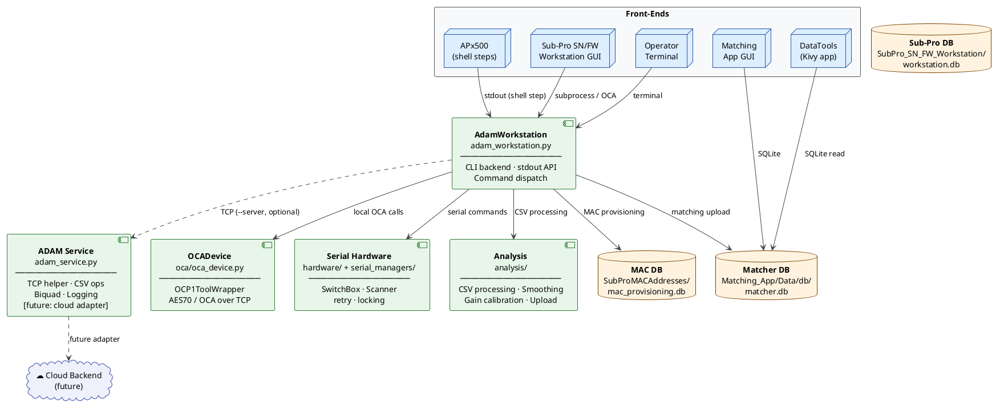

# ADAM Audio Production System — Overview

## Purpose

The ADAM Audio Production System is a modular backend infrastructure for automated production and end-of-line testing at ADAM Audio manufacturing sites. It provides hardware control, acoustic measurement integration, device provisioning, data management, and operator tooling through a unified, CLI-driven architecture.

The system is not a single application. It is a set of composable components that multiple front-ends can call through a stable stdout-based API. Current callers include Audio Precision APx500 shell steps, Tkinter desktop GUIs, batch scripts, and direct operator use from a terminal.

---

## System Architecture



---

## Component Layers

### CLI Backend — `adam_workstation.py`

The central dispatcher. Every production command is a subcommand of this CLI. APx500 shell steps call it with `pythonw.exe`, GUIs call it as a subprocess, operators run it directly. All responses are written to stdout — one stable line per command.

The parser is defined in `cli/workstation_parser.py`. Dispatch is controlled by `AdamWorkstation.command_map`. Adding a new command requires changes in three places: parser, `command_map`, and handler method.

→ Details: [workstation-cli-reference.md](workstation-cli-reference.md)

---

### OCA Device Control — `oca/oca_device.py`

`OCADevice` wraps `OCP1ToolWrapper` from the `oca_tools` package. The wrapper translates Python method calls into subprocess invocations of `adam-audio-asubs-cli.exe` — the compiled AES70/OCA CLI binary. All OCA communication happens locally on the workstation; the ADAM Service never handles OCA.

Supported operations include serial number and MAC address read/write, firmware flashing, gain calibration, mode and audio input selection, mute, phase delay, and factory-settings lock/unlock.

→ Details: [oca-device-control.md](oca-device-control.md), [ocp1-tool-wrapper.md](ocp1-tool-wrapper.md)

---

### Serial Hardware — `hardware/` and `serial_managers/`

Two USB serial devices are supported: a **SwitchBox** (custom RP2040 relay controller, `Switch/Switch.ino`) for audio signal routing, and a **Honeywell barcode scanner** for serial number capture. Both are managed through a two-layer design: a hardware class for device-specific protocol, and a manager class for retry logic, thread locking, and production logging.

Hardware managers are initialized lazily — the CLI can run any non-hardware command without a connected device.

→ Details: [hardware-integration.md](hardware-integration.md), [../Switch/README.md](../Switch/README.md)

---

### Analysis — `analysis/`

Python modules for AP CSV processing: column extraction, octave smoothing, distortion splitting and merging, L/R compensation, gain calibration calculation, and measurement upload to the matcher database. All analysis runs locally; service-backed execution is available for selected operations.

→ Details: [csv-and-measurements.md](csv-and-measurements.md)

---

### ADAM Service — `adam_service.py`

An optional TCP helper service that accepts JSON commands from workstations and returns string responses. Its current feature set (biquad calculation, CSV operations, trial tracking, workstation logging) represents the first examples of tasks that benefit from centralized execution. The service is the future integration point for cloud-based data management — production events and measurement results from every workstation can be routed through it to an external backend.

Discovery uses UDP broadcast on port `65433`. The `AdamConnector` (`adam_connector.py`) handles auto-discovery and optional service startup.

→ Details: [service-protocol.md](service-protocol.md)

---

### Desktop Applications

| Application | Technology | Purpose |
|---|---|---|
| **Matching App** | Tkinter | Operator GUI for L/R driver module pairing using Hungarian algorithm (RMSE-based). Reads matcher.db populated by APx EOL measurements. |
| **Sub-Pro SN/FW Workstation** | Tkinter | Guided workflow for firmware verification, serial-number programming, component part scanning, and history export. |
| **DataTools** | Kivy (native Windows EXE) | Measurement data viewer and database browser. Packaged with PyInstaller and Inno Setup installer. Current version: 1.1.0. |

→ Details: [matching-system.md](matching-system.md), [subpro-sn-fw-workstation.md](subpro-sn-fw-workstation.md)

---

### Provisioning — `SubProMACAddresses/`

MAC address pool management and provisioning for Sub-Pro devices. A SQLite database tracks the pool range, assigned addresses, and provisioning history per serial number. The `provision_mac` workstation command handles first-test assignment and retest validation.

→ Details: [mac_provisioning_workflow.md](mac_provisioning_workflow.md)

---

## APx500 Integration

APx500 project packages (`.approjx` ZIP files containing `project.xml`) invoke production commands through shell steps:

```xml
<Command>pythonw.exe</Command>
<Arguments>adam_workstation.py provision_mac $(ProductName) $(SerialNumber) $(DefaultMACAddress)</Arguments>
<WaitForExit>WaitForExitValidateResponse</WaitForExit>
<ExpectedResponse>successful</ExpectedResponse>
```

A shell step can validate stdout against `ExpectedResponse`, store it in a `ProgramOutputVariable`, or ignore it. The stdout value is the only contract — APx projects must not depend on log output, file paths, or timing behavior beyond what the command explicitly prints.

Current APx projects and their documented sequences:

| Project | Document |
|---|---|
| `SubPRO_v_1_0.approjx` | [subpro-v1-sequence.md](subpro-v1-sequence.md) |
| `H715System_Test_v_2_0_DV2.approjx` | [h715-system-test-sequence.md](h715-system-test-sequence.md) |
| `H715_ModuleMatching_v_1_0_DV2.approjx` | [h715-system-test-sequence.md](h715-system-test-sequence.md) |
| `ASubsTristar_v_0_2.approjx` | [asubstristar-v0-2-sequence.md](asubstristar-v0-2-sequence.md) |

→ Details: [apx500-integration.md](apx500-integration.md)

---

## Technology Stack

| Category | Technology |
|---|---|
| Language | Python 3.8+ |
| OCA device communication | `adam-audio-asubs-cli.exe` (compiled AES70 binary) via `OCP1ToolWrapper` |
| Serial hardware | `pyserial`, custom RP2040 firmware (`Switch.ino`) |
| Measurement integration | Audio Precision APx500 via `.approjx` project packages |
| Matching algorithm | `scipy.optimize.linear_sum_assignment` (Hungarian assignment) |
| Desktop GUIs | Tkinter (Matching App, Sub-Pro Workstation), Kivy (DataTools) |
| Packaging (DataTools) | PyInstaller + Inno Setup |
| Databases | SQLite (matcher, MAC provisioning, Sub-Pro workstation, DataTools settings) |
| Service communication | TCP/JSON (commands), UDP broadcast (discovery) |
| Logging | Python `logging` module, file-only for production commands |

---

## Design Principles

**Stdout is the API.** Every command prints exactly one stable response. APx500, GUIs, and scripts all read the same stdout. Logging, diagnostics, and debug output must never reach stdout.

**Local by default, service-optional.** All commands that support service execution also have a complete local implementation. The service is never a hard dependency.

**Lazy hardware initialization.** Serial hardware managers are created on first use, not at CLI startup. Helper, OCA, and CSV commands work without any physical hardware connected.

**Two-layer hardware design.** Device classes handle protocol bytes; manager classes handle retry, thread locking, and production logging. New hardware requires a new class in each layer.

**Extensibility without core changes.** New commands are added by extending the parser, `command_map`, and handler. New service actions are added by extending `AdamService.process_command`. Neither requires changes to existing handlers.

**Traceability.** All operations are logged with workstation ID, timestamps, and structured context. The matcher database and MAC provisioning database maintain full audit trails.

---

## Documentation Map

| Document | Contents |
|---|---|
| [architecture.md](architecture.md) | Process boundaries, runtime shapes, logging rules, APx project structure |
| [workstation-cli-reference.md](workstation-cli-reference.md) | All CLI commands, arguments, stdout contracts, adding new commands |
| [service-protocol.md](service-protocol.md) | TCP/UDP protocol, service architecture, cloud integration vision |
| [oca-device-control.md](oca-device-control.md) | OCADevice operations and stdout normalization |
| [ocp1-tool-wrapper.md](ocp1-tool-wrapper.md) | OCP1ToolWrapper internals, response parsing, build and install |
| [hardware-integration.md](hardware-integration.md) | SwitchBox and scanner class hierarchy, execution flow, adding new hardware |
| [csv-and-measurements.md](csv-and-measurements.md) | AP CSV formats, smoothing, distortion processing, L/R compensation |
| [matching-system.md](matching-system.md) | Matcher DB, pairing algorithm, driver status model, verify_system |
| [mac_provisioning_workflow.md](mac_provisioning_workflow.md) | MAC assignment, retest behavior, pool management |
| [apx500-integration.md](apx500-integration.md) | Shell step patterns, response contracts, variable usage |
| [troubleshooting.md](troubleshooting.md) | Common failures, log locations, validation commands |
