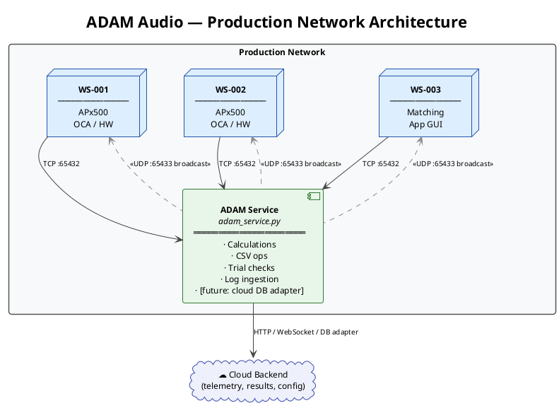
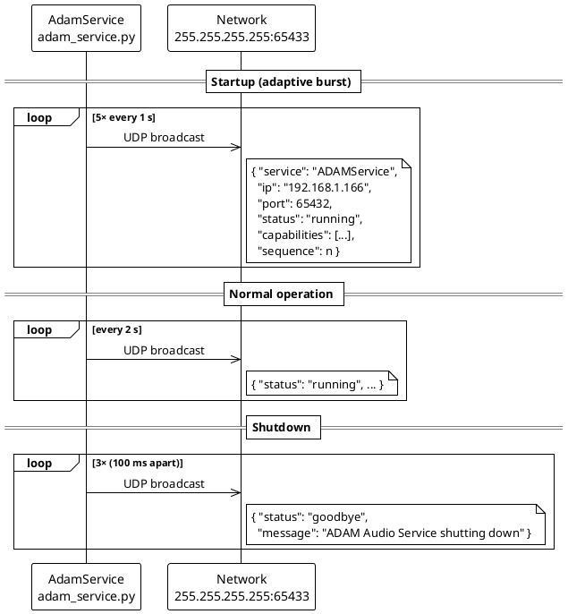
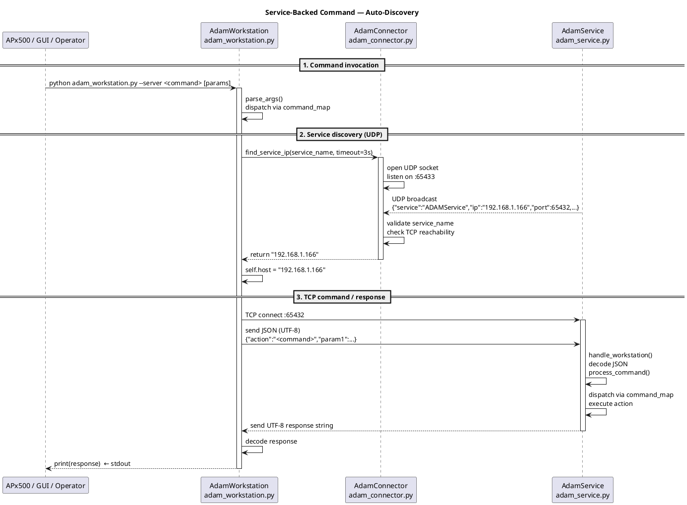
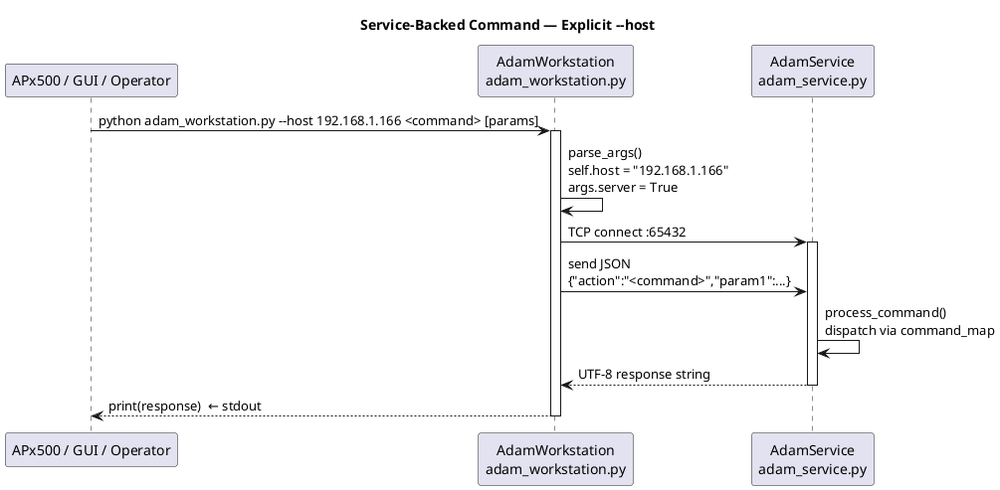
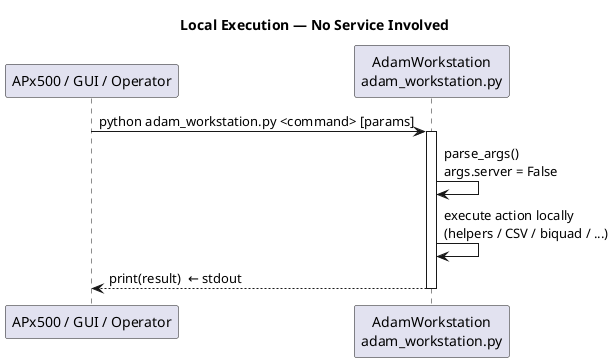
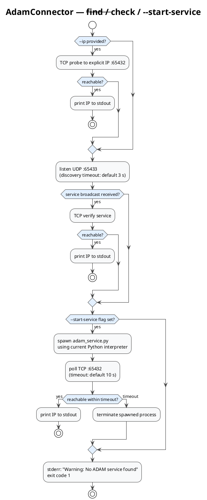

# ADAM Service Protocol

## Architectural Vision

The ADAM service ([../adam_service.py](../adam_service.py)) is designed as a **central network hub** for the entire production environment. It is deliberately not limited to a fixed set of helper functions. The actions currently implemented — biquad calculation, CSV processing, measurement-trial tracking, workstation logging — are early examples of a pattern that can be extended to cover any task that benefits from centralized execution across multiple workstations.

The key design intent is:

> Any production task that should be **shared across workstations**, **executed centrally**, or **connected to an external data system** can be moved into the service without changing the workstation's stdout contract.

**Current state.** Workstation commands typically run locally. Service execution is opt-in via `--server` or `--host`. The service can offload calculations, aggregate log data, and perform file operations on behalf of any workstation that connects.

**Future direction.** The service is the natural integration point for cloud-based data management. Production telemetry, measurement results, provisioning events, and pass/fail outcomes from every workstation in the network can flow through one service and then on to a cloud backend — without any front-end changes. Equally, the service can push shared configuration or reference data back to workstations. This architecture makes the service a transparent gateway between the shop-floor and any external system.

OCA device communication is intentionally kept local. OCA commands always run on the workstation that has physical network access to the device, through [../oca/oca_device.py](../oca/oca_device.py). The service never manages OCA directly.

---

## Role in a Complex Production Environment

In a multi-workstation production line the service provides a single point of control and observation:



From every workstation's perspective the interaction is the same regardless of whether a command runs locally or via the service: a single line is printed to stdout and the caller (APx500, a GUI, or an operator) reads it. The transport layer — local Python call versus TCP JSON round-trip — is invisible to the caller.

---

## Communication Architecture

### Layer 1 — Discovery (UDP Broadcast, port 65433)

When the service starts it launches a background thread that continuously broadcasts its presence over UDP. Workstations and the `AdamConnector` listen for these broadcasts to locate the service without any manual IP configuration.

The broadcast uses **adaptive timing**: five rapid announcements at 1-second intervals on startup, then a regular 2-second cycle. On shutdown the service sends three `"goodbye"` broadcasts so workstations detect the absence quickly (mDNS-style).



### Layer 2 — Command / Response (TCP, port 65432)

Workstations open a short-lived TCP connection per command. The protocol is minimal:

1. **Request** — UTF-8 encoded JSON object containing at minimum `{"action": "<name>"}` plus action-specific fields.
2. **Processing** — the service receives chunks until the JSON parses cleanly, dispatches the action, executes it, and assembles a response string.
3. **Response** — UTF-8 string sent back. Format depends on the action: a plain value, a path, a JSON-encoded object, or `"Error: <detail>"`. The connection is closed immediately after.

The request may include `"wait_for_response": false` to suppress the response — useful for fire-and-forget logging actions.

### Layer 3 — Local Fallback

Every workstation command that supports service execution also has a complete local implementation. When `--server` is not specified, and `--host` is not provided, the workstation runs the action in-process. This means the service is never a hard dependency: a workstation without a reachable service degrades gracefully to local execution with identical stdout output.

---

## Sequence Diagrams

### Full Service-Backed Command (with auto-discovery)

This is the typical path when a command uses `--server` but no `--host` is specified.



### Service-Backed Command with Explicit `--host`

When the service IP is already known (e.g., set once in an APx project variable), discovery is skipped entirely.



### Local Execution (no service)



### Service Startup and Check (AdamConnector)



---

## Code Architecture

### `AdamService` — Service Side

`adam_service.py` contains the `AdamService` class. Its responsibilities map directly to the communication layers above.

| Method | Responsibility |
|---|---|
| `__init__` | Bind TCP socket, start discovery thread, log startup info. |
| `_start_discovery` / `_discovery_broadcast_loop` | Background thread — periodic UDP broadcasts with service metadata. |
| `_get_discovery_data` | Assemble the broadcast payload (IP, port, hostname, capabilities, status). |
| `_send_goodbye_broadcast` | Three goodbye broadcasts on shutdown. |
| `handle_workstation` | Accept one TCP connection, buffer chunks until JSON is complete, call `process_command`, send response, close socket. |
| `process_command` | `command_map` dispatch — maps `action` strings to private handler methods. |
| `_<action>` methods | Per-action handlers (e.g. `_get_biquad_coefficients`, `_extract_csv_columns`). Each reads fields from the command dict and returns a string. |
| `start` | Main accept loop — `threading.Thread` per incoming connection so actions run concurrently. |

The `command_map` inside `process_command` is a plain Python dict mapping `action` strings to callables (lambdas that close over `command`). This is the registration point for new features.

### `AdamConnector` — Discovery and Startup

`adam_connector.py` provides `AdamConnector`, used both as a library and as a CLI tool.

| Method | Responsibility |
|---|---|
| `check_service` | Quick TCP reachability probe against a known IP. |
| `discover_service` | Listen on UDP `:65433`, return the first matching broadcast payload within timeout. |
| `find_service_ip` | Try direct IP → discovery → return IP or None. |
| `start_service` | Spawn `adam_service.py` as a subprocess and poll until TCP reachable. |

CLI modes: `--check` (prints availability text, exit code 0/1) and `--find` (prints IP to stdout, exit code 0/1). The `--start-service` flag adds the startup step before `--find`.

### `AdamWorkstation` — Workstation Side

Each service-capable command in `AdamWorkstation` follows the same pattern:

```python
def my_command(self, args):
    if args.server:
        command = {"action": "my_command", "param": args.param}
        response = self.send_command(command)  # TCP round-trip
        print(response)
        return
    # Local fallback
    print(local_implementation(args.param))
```

`send_command` handles host resolution, TCP connect/send/receive, error wrapping, and logging. It calls `_ensure_host_available` which either uses `self.host` (set from `--host`) or calls `_discover_service` (UDP via `AdamConnector`).

---

## Adding New Features to the Service

Adding a new action follows four steps.

### Step 1 — Add the handler method to `AdamService`

Private handler methods receive the full `command` dict and return a plain string. Validate the required fields and return an `"Error: ..."` string on failure.

```python
# In AdamService (adam_service.py)
def _my_new_action(self, command: dict) -> str:
    """Handle 'my_new_action' requests from workstations."""
    param = command.get("param")
    if param is None:
        return "Error: 'param' is required."
    try:
        result = do_the_work(param)
        return str(result)          # or json.dumps(result)
    except Exception as e:
        self.logger.error("my_new_action failed: %s", e)
        return f"Error: {e}"
```

### Step 2 — Register the action in `process_command`

Add one entry to the `command_map` dict inside `process_command`:

```python
command_map = {
    # ... existing entries ...
    "my_new_action": lambda: self._my_new_action(command),
}
```

### Step 3 — Add the workstation method

In `AdamWorkstation` (adam_workstation.py), add a method that either delegates to the service or runs locally:

```python
def my_new_action(self, args):
    if args.server:
        command = {"action": "my_new_action", "param": args.param}
        response = self.send_command(command)
        print(response)
        return
    # Local fallback (if applicable)
    print(local_my_new_action(args.param))
```

### Step 4 — Register in `command_map` and parser

Add the method to `self.command_map` in `AdamWorkstation.__init__`:

```python
"my_new_action": self.my_new_action,
```

Add the argparse subcommand to [../cli/workstation_parser.py](../cli/workstation_parser.py) following the existing pattern. Include `--server` if the command supports service execution, and `--host` if it may be called from APx with an explicit IP.

### Design rules to keep

- The handler must return exactly one stable string. That string is the contract for all callers.
- Never raise an exception out of a handler — catch and return `"Error: ..."`.
- No `print()` inside handlers — logging to `self.logger` only.
- Keep local and service implementations functionally identical. The transport must be invisible.
- Update this document and [workstation-cli-reference.md](workstation-cli-reference.md).

---

## Starting The Service

```powershell
python adam_service.py
```

Defaults:

| Setting | Default |
|---|---|
| Host binding | `0.0.0.0` |
| TCP command port | `65432` |
| UDP discovery port | `65433` |
| Service name | `ADAMService` |
| Discovery interval | `2` seconds (after startup burst) |

---

## AdamConnector CLI Reference

```powershell
# Quick availability check via discovery
python adam_connector.py --check

# Check specific IP first, then discovery fallback
python adam_connector.py --check --ip 192.168.1.100

# Find service IP (prints IP to stdout)
python adam_connector.py --find

# Find specific IP first, then discovery fallback
python adam_connector.py --find --ip 192.168.1.100

# Start service if not running, then return IP
python adam_connector.py --find --start-service
```

| Mode | Success stdout | Failure stdout/stderr | Exit code |
|---|---|---|---|
| `--check` | `ADAM Service available` | `No ADAM Service available` | `0` / `1` |
| `--find` | `<service_ip>` | `Warning: No ADAM service found` (stderr) | `0` / `1` |

Startup behavior with `--start-service`: check explicit IP → discovery → spawn `adam_service.py` → poll TCP until reachable or timeout → terminate spawned process on timeout and return exit code 1.

---

## Discovery Broadcast Payload

| Field | Meaning |
|---|---|
| `service` | Service name, usually `ADAMService`. |
| `company` | `ADAM Audio`. |
| `ip` | Service IP (derived from primary network route). |
| `port` | TCP command port. |
| `hostname` | Windows hostname of the service machine. |
| `timestamp` | Unix timestamp of the broadcast. |
| `version` | Protocol version string. |
| `capabilities` | Feature list: `BiquadFilters`, `MeasurementTrials`, `ProductionLogging`, `HelperFunctions`, `WorkstationSupport`. |
| `discovery_port` | UDP discovery port. |
| `status` | `running` or `goodbye`. |
| `note` | Human-readable notes. |
| `sequence` | Monotonically increasing broadcast counter. |

---

## TCP Command Format

Minimal request:

```json
{"action": "generate_timestamp_extension"}
```

Request with parameters:

```json
{
  "action": "extract_csv_columns",
  "input_path": "C:/Data/source.csv",
  "columns": [0, 1, 2],
  "output_filename": "extracted.csv",
  "output_dir": "C:/Data/Temp"
}
```

Optional fields accepted by all actions:

| Field | Default | Meaning |
|---|---|---|
| `wait_for_response` | `true` | Set to `false` for fire-and-forget (logging). |

Responses are always UTF-8 strings. Some actions return plain text, others return JSON-encoded strings. Failures always return a string starting with `Error:`.

---

## Current Service Actions

These are the actions currently registered in `process_command`. They serve as working examples of the pattern and as the production-ready feature set for the first service implementation.

| Action | Request fields | Response |
|---|---|---|
| `generate_timestamp_extension` | — | Timestamp suffix string. |
| `construct_path` | `paths: list[str]` | Joined path or `Error: ...`. |
| `get_timestamp_subpath` | — | Date/time subpath string. |
| `generate_file_prefix` | `strings: list[str]` | Combined prefix or `Error: ...`. |
| `extract_csv_columns` | `input_path`, `columns`, `output_filename`, optional `output_dir` | Output path or `Error: ...`. |
| `split_ap_distortion_csv` | `input_path`, optional `output_dir`, `fraction`, `output_prefix` | JSON mapping metric names to paths or `Error: ...`. |
| `octave_smooth_ap_csv` | `input_path`, `fraction`, optional `output_filename`, `output_dir` | Output path or `Error: ...`. |
| `merge_ap_distortion_csvs` | `input_paths`, optional `output_dir`, `fraction`, `output_prefix` | JSON mapping metric names to paths or `Error: ...`. |
| `get_biquad_coefficients` | `filter_type`, `gain`, `peak_freq`, `Q`, `sample_rate` | JSON coefficient list string or `Error: ...`. |
| `check_measurement_trials` | `serial_number`, `csv_path`, `max_trials` | Permission/result text. |
| `log_workstation_task` | workstation log payload | Logging result text. |
| `add_measurement` | measurement payload | JSON result or `Error: ...`. |

---

## Error Handling

| Condition | Service response |
|---|---|
| `command` is not a dict or has no `action` | `Error: Invalid command format.` |
| `action` not in `command_map` | `Error: Unknown action.` |
| Missing required field in handler | `Error: '<field>' is required.` |
| Runtime exception in handler | `Error: <exception detail>` |
| TCP connection refused (workstation side) | `Error: [Errno 111] Connection refused` |
| Discovery timeout (workstation side) | `Error: No ADAM service available. Use --host to specify manually.` |

For APx-facing workflows, prefer workstation commands over direct service calls. The stdout contract lives in the workstation, not in the service, and that separation must be maintained regardless of where execution happens.
| `octave_smooth_ap_csv` | `input_path`, `fraction`, optional `output_filename`, `output_dir` | Output path or `Error: ...`. |
| `merge_ap_distortion_csvs` | `input_paths`, optional `output_dir`, `fraction`, `output_prefix` | JSON mapping metric names to paths or `Error: ...`. |
| `get_biquad_coefficients` | `filter_type`, `gain`, `peak_freq`, `Q`, `sample_rate` | JSON/list coefficient string or `Error: ...`. |
| `check_measurement_trials` | `serial_number`, `csv_path`, `max_trials` | Permission/result text. |
| `log_workstation_task` | workstation log payload | Logging result text. |
| `add_measurement` | measurement payload | JSON result or `Error: ...`. |

## Workstation `--server` Path

For commands that define `--server`, [../adam_workstation.py](../adam_workstation.py) builds a JSON command, sends it to the service, and prints the raw response to stdout. This means APx500 still sees only stdout, even when the actual work was done by the service.

Host resolution behavior for service-backed commands:

1. If `--host` is provided, workstation connects directly to that IP.
2. If `--host` is omitted, workstation calls `AdamConnector.find_service_ip(...)` (discovery) to resolve a service IP.
3. If discovery fails, workstation prints `Error: No ADAM service available. Use --host to specify manually.`

Examples:

```powershell
# Local execution (no service)
python adam_workstation.py extract_csv_columns input.csv 0 1 out.csv

# Service-backed execution with explicit IP
python adam_workstation.py --host 192.168.1.166 extract_csv_columns input.csv 0 1 out.csv

# Service-backed execution with auto-discovery
python adam_workstation.py extract_csv_columns input.csv 0 1 out.csv --server
```

## Error Handling

Invalid command objects return `Error: Invalid command format.` Unknown actions return `Error: Unknown action.` Validation failures and exceptions return `Error: ...`.

For APx-facing workflows, prefer workstation commands over direct service calls so the stdout contract stays in one place.