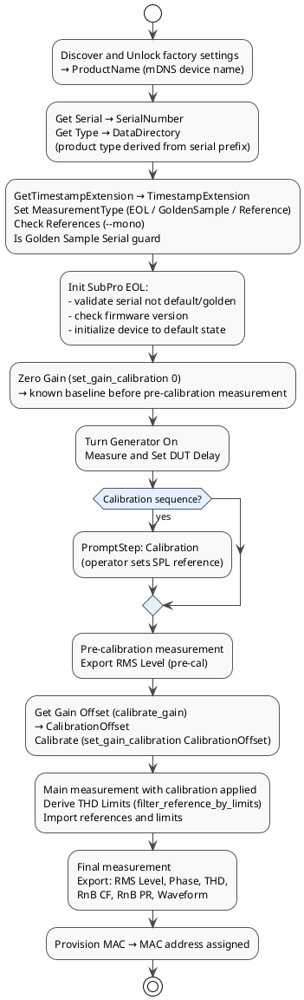

# SubPRO v1.0 — APx Sequence Walkthrough

This document describes what happens in `SubPRO_v_1_0.approjx`, based on the `project.xml` sequence and shell-step definitions inside the `.approjx` ZIP package.

## Scope

- Project package: `SubPRO_v_1_0.approjx`
- Source analyzed: `project.xml` inside the `.approjx` ZIP
- Focus:
  - execution sequence at high level
  - shell commands in document order with full arguments
  - APx variable use and output handling
  - calibration and measurement flow
  - MAC provisioning at end of successful run

The operator-facing procedure is documented in [subpro-sn-fw-workstation.md](subpro-sn-fw-workstation.md) and [../SubPro_SN_FW_Workstation/docs/user_manual.md](../SubPro_SN_FW_Workstation/docs/user_manual.md).

---

## Checklist Sequences

| Sequence | Purpose |
|---|---|
| `EOL` | Standard production end-of-line test |
| `Golden Sample` | Reference measurement under golden-sample mode |
| `Calibration` | Periodic calibration using a calibration microphone |
| `Create Reference` | Record a new reference measurement for future use |

---

## High-Level Runtime Flow



---

## Shell Commands in Sequence Order

### Init Group — Runs Before Measurements

| # | Step name | Command and full arguments | Wait mode | Output handling |
|---|---|---|---|---|
| 4 | `Discover and Unlock` | `$(PythonRunner) adam_workstation.py discover_and_unlock_factory_settings $(UnlockSignature) --timeout 10` | `WaitForExitStoreOutputInVariable` | `ProductName = <device name>` |
| 5 | `GetTimestampExtension` | `$(PythonRunner) adam_workstation.py generate_timestamp_extension` | `WaitForExitStoreOutputInVariable` | `TimestampExtension = <timestamp>` |
| 6 | `Set EOL` | `$(PythonRunner) -c "print('EOL')"` | `WaitForExitStoreOutputInVariable` | `MeasurementType = EOL` |
| 7 | `Set GS` | `$(PythonRunner) -c "print('GoldenSample')"` | `WaitForExitStoreOutputInVariable` | `MeasurementType = GoldenSample` |
| 8 | `Set Reference` | `$(PythonRunner) -c "print('Reference')"` | `WaitForExitStoreOutputInVariable` | `MeasurementType = Reference` |
| 9 | `Get Serial` | `$(PythonRunner) adam_workstation.py get_serial_number $(ProductName)` | `WaitForExitStoreOutputInVariable` | `SerialNumber = <serial>` |
| 10 | `Get Type` | `$(PythonRunner) adam_workstation.py get_product_type $(SerialNumber)` | `WaitForExitStoreOutputInVariable` | `DataDirectory = Sub10PRO / Sub8PRO` |
| 11 | `Check References` | `$(PythonRunner) adam_workstation.py setup_references "$(MyDocuments)\$(DataDirectory)" --mono` | `WaitForExitIgnoreResponse` | Output ignored |
| 12 | `Is Golden Sample Serial` | `$(PythonRunner) adam_workstation.py is_golden_sample $(SerialNumber) $(GoldenSampleSerial) True` | `WaitForExitValidateResponse` | Expects `True` (Golden Sample path only) |
| 13 | `Init SubPro EOL` | `$(PythonRunner) adam_workstation.py eol_init_sub $(ProductName) $(SerialNumber) $(DefaultSerial) $(GoldenSampleSerial) $(TargetFirmware)` | `WaitForExitValidateResponse` | Expects `successful` |
| 14 | `Zero Gain` | `$(PythonRunner) adam_workstation.py set_gain_calibration 0 $(ProductName)` | `WaitForExitValidateResponse` | Expects `True` |

### Measurement Group — Runs During Acoustic Measurements

| # | Step name | Command and full arguments | Wait mode | Output handling |
|---|---|---|---|---|
| 1 | `Get Gain Offsett` | `$(PythonRunner) adam_workstation.py calibrate_gain "$(MyDocuments)\$(DataDirectory)\$(MeasurementsDirectory)\$(MeasurementType)\$(Year)\$(Month)_$(Day)\$(SerialNumber)_$(TimestampExtension)_RMS_Level_Sub_pre_calibration.csv" "$(MyDocuments)\$(DataDirectory)\References\$(MeasurementType)\RMS.csv" -f $(CalibrationFrequencies)` | `WaitForExitStoreOutputInVariable` | `CalibrationOffset = <dB value>` |
| 2 | `Calibrate` | `$(PythonRunner) adam_workstation.py set_gain_calibration $(CalibrationOffset) $(ProductName)` | `WaitForExitValidateResponse` | Expects `True` |
| 3 | `Derive THD Limits` | `$(PythonRunner) adam_workstation.py filter_reference_by_limits "$(MyDocuments)\$(DataDirectory)\References\$(MeasurementType)\THD.csv" "$(MyDocuments)\$(DataDirectory)\References\$(MeasurementType)\Limits\THD.csv" --output-filename "THD_Ref.csv" --output-dir "$(MyDocuments)\$(DataDirectory)\Temp"` | `WaitForExitValidateResponse` | Expects `successful` |

### End Group — After All Exports

| # | Step name | Command and full arguments | Wait mode | Output handling |
|---|---|---|---|---|
| 15 | `Provision MAC` | `$(PythonRunner) adam_workstation.py provision_mac $(ProductName) $(SerialNumber) $(DefaultMACAddress)` | `WaitForExitValidateResponse` | Expects `successful` |

---

## Full Sequence Step Order

Combines APx-native and shell steps in their actual execution order:

| Position | Step type | Name | Notes |
|---|---|---|---|
| 1 | `ShellStep` | Discover and Unlock | `discover_and_unlock_factory_settings` → `ProductName` |
| 2 | `ShellStep` | GetTimestampExtension | `generate_timestamp_extension` → `TimestampExtension` |
| 3 | `ShellStep` | Set EOL / Set GS / Set Reference | Sets `MeasurementType` (checklist-driven) |
| 4 | `ShellStep` | Get Serial | `get_serial_number` → `SerialNumber` |
| 5 | `ShellStep` | Get Type | `get_product_type` → `DataDirectory` (Sub8PRO or Sub10PRO) |
| 6 | `ShellStep` | Check References | `setup_references --mono` — ensures mono reference files exist |
| 7 | `ShellStep` | Is Golden Sample Serial | Guard: only `True` in Golden Sample path |
| 8 | `ShellStep` | Init SubPro EOL | Serial validation, firmware check, device init |
| 9 | `ShellStep` | Zero Gain | `set_gain_calibration 0` — resets to zero before pre-cal |
| 10 | `EnableGeneratorStep` | Turn Generator On | APx generator enabled |
| 11 | `SetDeviceDelayStep` | Measure and Set DUT Delay | APx latency compensation |
| 12 | `MeasurementStep` | *(pre-calibration)* | APx acoustic measurement for calibration baseline |
| 13 | `PromptStep` | Calibration | *Calibration sequence only* — operator sets SPL reference |
| 14 | `LoadCustomDataStep` | Refresh Defined Result(s) | APx result refresh |
| 15 | `EnableGeneratorStep` | Generate | APx generator re-enabled |
| 16 | `SaveGeneratorWaveformStep` | Save Generator Waveform | APx waveform captured |
| 17 | `MeasurementStep` | *(pre-cal RMS)* | Measurement for gain offset calculation |
| 18 | `ImportResultDataStep` | Import Reference | RMS reference loaded into APx |
| 19 | `MeasurementStep` | *(pre-cal result)* | APx result computation |
| 20 | `LoadCustomDataStep` | Refresh Defined Result(s) | APx result refresh |
| 21 | `ExportResultDataStep` | Export RMS Level | Pre-cal RMS CSV (`..._RMS_Level_Sub_pre_calibration.csv`) |
| 22 | `ShellStep` | Get Gain Offsett | `calibrate_gain` → `CalibrationOffset` |
| 23 | `ShellStep` | Calibrate | `set_gain_calibration $(CalibrationOffset)` applied to DUT |
| 24 | `EnableGeneratorStep` | Generate | APx generator re-enabled |
| 25 | `SaveGeneratorWaveformStep` | Save Generator Waveform | APx waveform captured |
| 26 | `MeasurementStep` | *(main measurement)* | Calibrated acoustic measurement |
| 27 | `ShellStep` | Derive THD Limits | `filter_reference_by_limits` → `Temp\THD_Ref.csv` |
| 28 | `ImportResultDataStep` | Import Reference (×3) | RMS, Phase, THD references loaded |
| 29 | `ImportLimitsDataStep` | Import Limits (×4) | Limits loaded (upper/lower for each measurand) |
| 30 | `MeasurementStep` | *(final)* | APx result computation |
| 31 | `LoadCustomDataStep` | Refresh Defined Result(s) | APx result refresh |
| 32 | `ExportResultDataStep` | Export RMS Level | Final RMS CSV |
| 33 | `ExportResultDataStep` | Export Phase | Phase CSV |
| 34 | `ExportResultDataStep` | Export Result Data | THD CSV |
| 35 | `ExportResultDataStep` | Export Rub and Buzz Crest Factor | RnB CF CSV |
| 36 | `ExportResultDataStep` | Export Rub and Buzz Peak Ratio | RnB PR CSV |
| 37 | `ExportResultDataStep` | Export Result Data | Waveform CSV |
| 38 | `ShellStep` | Provision MAC | `provision_mac` — assigns unique MAC address to DUT |

---

## Notable Differences from ASubsTristar

| Aspect | ASubsTristar | SubPRO |
|---|---|---|
| Python launcher | `pythonw.exe` (hardcoded) | `$(PythonRunner)` variable — portable across installations |
| Product type detection | Not present | `get_product_type` maps serial prefix → `DataDirectory` automatically |
| `Zero Gain` step | Not present | Resets gain calibration to 0 before pre-calibration measurement |
| MAC provisioning | Last step | Last step (same) |
| Sequences | EOL, Golden Sample | EOL, Golden Sample, Calibration, Create Reference |
| Mono references | Always mono (`--mono`) | Always mono (`--mono`) |

### `$(PythonRunner)`

The variable `$(PythonRunner)` holds the full path to `pythonw.exe` inside the tool's virtual environment. It is set once in **Project → Project Properties → Variables** and referenced in every shell step's `Command` field. This ensures APx always calls the venv Python, not the system Python.

→ See [apx500-integration.md](apx500-integration.md#python-executable-and-virtual-environment) for configuration details.

### `get_product_type` — Dynamic `DataDirectory`

The step `Get Type` runs `get_product_type $(SerialNumber)` and stores the result in `DataDirectory`. This means the same APx project handles multiple SubPRO product variants:

| Serial prefix | `DataDirectory` |
|---|---|
| `CI...` | `Sub8PRO` |
| `CJ...` | `Sub10PRO` |

All subsequent reference paths, measurement export paths, and limit imports resolve correctly without any further project changes.

### `Zero Gain` Before Pre-Calibration

`eol_init_sub` already sets the gain calibration to 0 as part of device initialization. The additional `Zero Gain` shell step after `Init SubPro EOL` is an explicit belt-and-suspenders reset that guarantees the gain is at 0 before the pre-calibration RMS export. The calibration math (`calibrate_gain`) then computes the correct offset from this known baseline.

---

## APx Project Variables

| Variable | Set by | Purpose |
|---|---|---|
| `PythonRunner` | Project setting | Python executable (e.g. `pythonw.exe` or venv path) |
| `DataDirectory` | `get_product_type` (runtime) | Product-specific data root (`Sub8PRO` or `Sub10PRO`) |
| `MeasurementsDirectory` | Project setting | Sub-folder name for measurement CSVs |
| `GoldenSampleSerial` | Project setting | Serial of the designated golden-sample unit |
| `DefaultSerial` | Project setting | Factory default serial number (rejected in EOL) |
| `DefaultMACAddress` | Project setting | Factory default MAC address (e.g. `02:00:00:00:00:00`) |
| `TargetFirmware` | Project setting | Required firmware version string (e.g. `1.0.0rc6`) |
| `UnlockSignature` | Project setting | Factory settings unlock signature |
| `CalibrationFrequencies` | Project setting | Space-separated Hz values for `calibrate_gain` |
| `ProductName` | `discover_and_unlock_factory_settings` | mDNS device name (e.g. `ADAM-Sub8PRO-001`) |
| `SerialNumber` | `get_serial_number` | Device serial number |
| `TimestampExtension` | `generate_timestamp_extension` | Per-unit filename suffix |
| `MeasurementType` | `Set EOL` / `Set GS` / `Set Reference` shell step | `EOL`, `GoldenSample`, or `Reference` |
| `CalibrationOffset` | `calibrate_gain` | Gain correction in dB, stored as float string |
| `Year` / `Month` / `Day` | APx built-in | Date path components |

---

## Measurands and Result Families

| Measurand | Export |
|---|---|
| RMS Level | Pre-calibration CSV + final CSV |
| Phase (vs frequency) | Final CSV |
| Level and Distortion (THD) | Final CSV |
| Rub and Buzz Crest Factor | Final CSV |
| Rub and Buzz Peak Ratio | Final CSV |
| Waveform | Final CSV |

---

## Key Exported Files

```
$(MyDocuments)\$(DataDirectory)\$(MeasurementsDirectory)\$(MeasurementType)\$(Year)\$(Month)_$(Day)\
  $(SerialNumber)_$(TimestampExtension)_RMS_Level_Sub_pre_calibration.csv   ← calibrate_gain input
  $(SerialNumber)_$(TimestampExtension)_RMS_Level.csv
  $(SerialNumber)_$(TimestampExtension)_Phase.csv
  $(SerialNumber)_$(TimestampExtension)_THD.csv
  $(SerialNumber)_$(TimestampExtension)_RnB_CF.csv
  $(SerialNumber)_$(TimestampExtension)_RnB_PR.csv
  $(SerialNumber)_$(TimestampExtension)_Waveform.csv

$(MyDocuments)\$(DataDirectory)\Temp\
  THD_Ref.csv                                                                ← filter_reference_by_limits output
```

---

## Related

| File | Role |
|---|---|
| [subpro-sn-fw-workstation.md](subpro-sn-fw-workstation.md) | Sub-Pro SN/FW GUI — firmware flash and serial-number programming |
| [asubstristar-v0-2-sequence.md](asubstristar-v0-2-sequence.md) | ASubsTristar APx sequence walkthrough (similar structure) |
| [mac_provisioning_workflow.md](mac_provisioning_workflow.md) | First-test and retest MAC provisioning behavior |
| [csv-and-measurements.md](csv-and-measurements.md) | CSV format, calibration math, reference filtering |
| [workstation-cli-reference.md](workstation-cli-reference.md) | All workstation commands used in this project |
