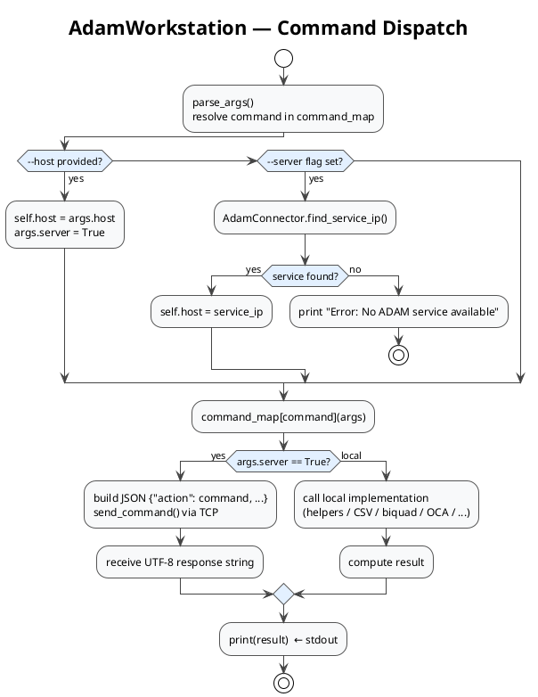

# Workstation CLI Reference

## Design and Role

[../adam_workstation.py](../adam_workstation.py) is the **general-purpose production backend**. It is called by APx500 shell steps, custom GUIs, operator scripts, and directly from a terminal — using exactly the same command surface every time. The backend is intentionally decoupled from any single front-end.

The authoritative command-line parser is [../cli/workstation_parser.py](../cli/workstation_parser.py). Command dispatch is controlled by `AdamWorkstation.command_map`. Every registered command maps to one handler method that is responsible for exactly one stable stdout line.

## The Stdout Contract

> **The printed output is the API.** Logging, diagnostics, and debug output must never reach stdout.

All logging goes to `logs/adam_audio/adam_workstation_log_YYYY-MM-DD.log` only. A stray `print()` in a command handler breaks any APx shell step that validates or stores the response.

APx500 can:
- validate stdout against `ExpectedResponse` (e.g. `successful`, `True`)
- store stdout in a `ProgramOutputVariable` for later use
- ignore stdout entirely

The rule is the same regardless of front-end: **one stable response per command, no diagnostic noise in stdout**.

## Command Dispatch Flow



## General Form

```powershell
python adam_workstation.py [--host SERVICE_IP] [--service-port 65432] [--service-name ADAMService] <command> [args...]
```

APx500 shell steps use `pythonw.exe` to suppress the console window:

```powershell
pythonw.exe adam_workstation.py <command> [args...]
```

Local execution (no service required):

```powershell
python adam_workstation.py scan_serial
python adam_workstation.py extract_csv_columns input.csv 0 1 out.csv
```

Service-backed execution (for commands that support `--server`):

```powershell
# Explicit IP — discovery skipped
python adam_workstation.py --host 192.168.1.166 extract_csv_columns input.csv 0 1 out.csv

# Auto-discovery
python adam_workstation.py extract_csv_columns input.csv 0 1 out.csv --server
```

See [service-protocol.md](service-protocol.md) for the full service communication architecture.

## Global Options

| Option | Meaning |
|---|---|
| `--host`, `--service-host` | ADAM service IP address. If omitted, service-backed commands try discovery. |
| `--service-port` | TCP service port. Default `65432`. |
| `--service-name` | Service discovery name. Default `ADAMService`. |
| `--scanner-type` | Scanner implementation. Current choice: `honeywell`. |

Passing `--host` sets `args.server = True` only for commands that have a `--server` flag in the parser. OCA commands still communicate locally with the target device.

## Command Summary

### OCA Discovery And Device Identity

| Command | Arguments | Stdout |
|---|---|---|
| `discover` | `[--timeout seconds]` | Discovered device name, or `Error: discover failed - ...`. |
| `discover_and_unlock_factory_settings` | `signature [--timeout seconds]` | Discovered device name, or `Error: ...`. |
| `get_serial_number` | `target [port]` | Serial number value. |
| `set_serial_number` | `value target [port]` | `True` on success or device result fallback. |
| `get_model_description` | `target [port]` | Model/name/raw value. |
| `get_firmware_version` | `target [port]` | Firmware version/raw value. |
| `update_firmware` | `target firmware_image_path [port] [--timeout seconds]` | `successful` or `Error: ...`. |

`target` can be an IP address or an mDNS/device name. If `port` is omitted, the OCA wrapper uses its default device-name behavior.

### OCA Audio And Factory Settings

| Command | Arguments | Stdout |
|---|---|---|
| `get_gain_calibration` | `target [port]` | First returned calibration value or empty string. |
| `set_gain_calibration` | `value target [port]` | `True`/`False` from OCA result. |
| `get_mode` | `target [port]` | Mode string. |
| `set_mode` | `position target [port]` | `True`/`False`. |
| `get_audio_input` | `target [port]` | Input mode string. |
| `set_audio_input` | `mode target [port]` | OCA result. |
| `get_bass_management` | `target [port]` | Bass-management mode. |
| `set_bass_management` | `position target [port]` | `True`/`False`. |
| `get_bass_management_bypass` | `target [port]` | Bypass state. |
| `set_bass_management_bypass` | `position target [port]` | Success/state/result. |
| `get_gain` | `target [port]` | Gain value. |
| `set_gain` | `value target [port]` | `True`/`False`. |
| `get_phase_delay` | `target [port]` | Phase delay value. |
| `set_phase_delay` | `position target [port]` | `True`/`False`. |
| `get_mute` | `target [port]` | Mute state. |
| `set_mute` | `position target [port]` | `True`/`False`. |
| `get_mac_address` | `target [port]` | MAC address value. |
| `set_mac_address` | `value target [port]` | Success/value/result. |
| `lock_factory_settings` | `target [port]` | `successful` or `Error: ...`. |
| `unlock_factory_settings` | `signature target [port]` | `successful` or `Error: ...`. |

Accepted positions are enforced mostly by firmware/OCA tooling, not by argparse. Common values include `internal-dsp`, `backplate`, `aes3`, `analogue-xlr`, `stereo`, `wide`, `lfe`, `enabled`, `disabled`, `normal`, `mute`, and phase positions such as `deg0`.

### Production Helpers

| Command | Arguments | Stdout |
|---|---|---|
| `generate_timestamp_extension` | `[--server]` | Timestamp string. |
| `get_timestamp_subpath` | `[--server]` | Date/time subpath. |
| `generate_file_prefix` | `strings... [--server]` | Combined file prefix. |
| `construct_path` | `paths... [--server]` | Joined path. |
| `setup_references` | `path [--mono]` | Status message; APx often ignores output. |
| `is_golden_sample` | `scanned_serial golden_sample_serial measure_golden_sample` | `True` or `False`. |
| `is_default_serial` | `scanned_serial default_serial measure_default` | `True` or `False`. |

### Serial Hardware

| Command | Arguments | Stdout |
|---|---|---|
| `set_channel` | `1` or `2` | `Channel set to 1` or `Channel set to 2`, or `Error: ...`. |
| `open_box` | none | `Box status: <status>`, or `Error: ...`. |
| `scan_serial` | none | Scanned serial number, or `NaN` on failure. |

The parser currently allows only channels `1` and `2`. Any documentation or APx project that refers to channels `3` or `4` is stale for the current code.

### Biquad And Calibration

| Command | Arguments | Stdout |
|---|---|---|
| `get_biquad_coefficients` | `filter_type gain peak_freq Q sample_rate` | JSON/list response from service. |
| `calibrate_gain` | `input_file target_file --frequencies f1 f2 ...` | Average gain offset as a number with two decimals, or `ERROR: ...`. |

Parser-only commands: `set_device_biquad` and `get_device_biquad` are present in [../cli/workstation_parser.py](../cli/workstation_parser.py), but they are not in `AdamWorkstation.command_map`. They should be treated as unavailable until handlers are added.

### CSV And Measurement Processing

| Command | Arguments | Stdout |
|---|---|---|
| `extract_csv_columns` | `input_path columns... output_filename [--output-dir dir] [--server]` | Output CSV path. |
| `split_ap_distortion_csv` | `input_path [--output-dir dir] [--fraction n] [--output-prefix prefix] [--server]` | Local: `metric: path` lines. Service: JSON mapping. |
| `octave_smooth_ap_csv` | `input_path [--fraction n] [--output-filename name] [--output-dir dir] [--server]` | Output CSV path. |
| `merge_ap_distortion_csvs` | `input_paths... [--output-dir dir] [--fraction n] [--output-prefix prefix] [--server]` | Local: `metric: path` lines. Service: JSON mapping. |
| `filter_reference_by_limits` | `reference_path limits_path [--output-filename name] [--output-dir dir]` | `successful` on success, otherwise error text. |
| `compensate_lr_diff` | `input_path diff_path output_path` | Output path, otherwise error text. |
| `extract_compensated_lr_diff_pair` | `diff_path input1 output1 input2 output2` | Output path 1 then output path 2, otherwise error text. |
| `extract_compensated_lr_diff_combined` | `diff_path input1 input2 output_path` | Output path, otherwise error text. |
| `upload_measurement` | `measurement_path --serial-number SN [--write-db] [--db-path path]` | `True` or `False`. |
| `check_measurement_trials` | `serial_number csv_path max_trials` | Service response string. |

`upload_measurement --server` is deprecated and disabled. The command writes directly to the local matcher DB.

### Sub-Pro Initialization And MAC Provisioning

| Command | Arguments | Stdout |
|---|---|---|
| `init_sub` | `target [port]` | `Initialization successful` or `Initialization failed: ...`. |
| `eol_init_sub` | `target scanned_serial default_serial golden_sample_serial target_fw_version [port] [--timeout seconds]` | `successful` or `Error: ...`. |
| `provision_mac` | `target serial default_mac [port] [--arp-delay seconds]` | `successful` or `Error: ...`. |
| `init_mac_db` | none | JSON status object. |
| `set_mac_range` | `start_mac end_mac [--warn-threshold n]` | JSON status object. |
| `get_mac_pool_status` | none | JSON status object. |
| `export_mac_log` | `output_path [--status status] [--serial serial]` | JSON status object. |
| `register_golden_sample` | `serial [--note text]` | `registered: <serial>` or `already registered: <serial>`. |

MAC provisioning details are documented in [MAC Provisioning Workflow](mac_provisioning_workflow.md), [MAC Provisioning Code](mac_provisioning_code.md), and [MAC Provisioning Database](mac_provisioning_database.md).

### Matching And System Build

| Command | Arguments | Stdout |
|---|---|---|
| `verify_system` | `system_sn module_sn_1 module_sn_2 [--db-path path]` | `True` on success, otherwise error text. |

The command checks the matcher database to ensure the two module serials are an assigned/valid pair and links them to the system serial.

## Validation Commands

List all registered subcommands:

```powershell
python adam_workstation.py --help
```

Inspect one command's arguments:

```powershell
python adam_workstation.py extract_csv_columns --help
```

Quick smoke test (local execution, no service):

```powershell
python adam_workstation.py set_channel 1
python adam_workstation.py generate_timestamp_extension
```

To detect parser/dispatcher drift, compare subcommand names in [../cli/workstation_parser.py](../cli/workstation_parser.py) against the keys of `AdamWorkstation.command_map` in [../adam_workstation.py](../adam_workstation.py). A command present in the parser but missing from `command_map` will fail silently at runtime.

---

## Adding New Commands

Adding a new command requires changes in three places and must preserve the stdout contract.

### Step 1 — Add the argparse subcommand

In [../cli/workstation_parser.py](../cli/workstation_parser.py), add a `subparsers.add_parser(...)` block. Include `--server` if the command supports service-backed execution.

```python
# In build_workstation_parser() (cli/workstation_parser.py)
my_cmd_parser = subparsers.add_parser(
    "my_command",
    help="One-line description shown in --help"
)
my_cmd_parser.add_argument("input_path", type=str, help="Path to input file")
my_cmd_parser.add_argument("--server", action="store_true",
    help="Run via ADAM service instead of locally")
```

### Step 2 — Add the handler method

In [../adam_workstation.py](../adam_workstation.py), add a method to `AdamWorkstation`. The method receives the parsed `args` object and must `print()` exactly one stable response.

```python
# In AdamWorkstation (adam_workstation.py)
def my_command(self, args):
    if args.server:
        command = {"action": "my_command", "input_path": args.input_path}
        response = self.send_command(command)
        print(response)
        return
    # Local fallback — identical behavior, no service required
    result = local_my_command(args.input_path)
    print(result)
```

Rules:
- **Never** write to stdout except the single response line.
- **Never** raise an unhandled exception — catch and print `f"Error: {e}"`.
- Logging goes to `WORKSTATION_LOGGER` only.

### Step 3 — Register in `command_map`

In `AdamWorkstation.__init__`, add one entry to `self.command_map`:

```python
"my_command": self.my_command,
```

### Step 4 — Register the service action (if applicable)

If the command delegates to the service, add the corresponding handler to `AdamService.process_command` in [../adam_service.py](../adam_service.py). See [service-protocol.md](service-protocol.md) for the full service-side steps.

### Step 5 — Update documentation

Update this file and [apx500-integration.md](apx500-integration.md) with the new command's arguments, stdout value, and any APx500 integration notes.